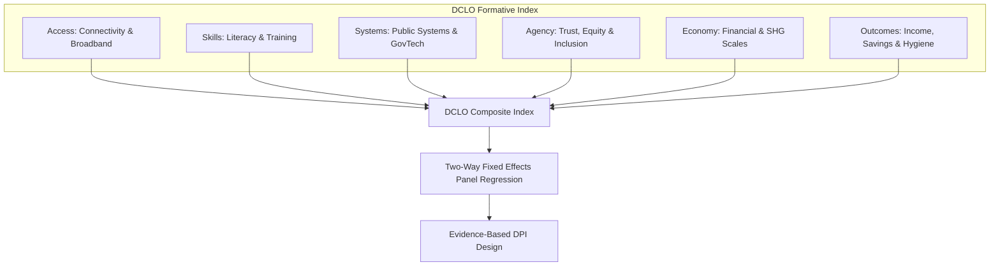

# DCLO Dual-Track Empirical Index & Dashboard

> [!NOTE]
> This repository is the unified, one-stop resource hosting the entire technical and empirical ecosystem for the **Digital Capabilities for Life Outcomes (DCLO)** PhD research. It houses raw-to-gold data pipelines, causal panel econometric models, a systematic literature review (SLR) database, the official PhD synopsis submission, and an interactive Streamlit dashboard.

---

## 🌟 Theoretical & Empirical Framework

The **DCLO (Digital Capabilities for Life Outcomes)** index addresses the measurement gap between digital access (DPI) and meaningful human development (life outcomes). Moving beyond traditional ICT indexes, DCLO is measured as a **multidimensional formative composite** defined by six core pillars:

$$DCLO_{i,t} = \frac{1}{6} \sum_{d \in D} \text{DomainScore}_{i,t}^d$$

Where $D = \{\text{Access (ACC)}, \text{Skills (SKL)}, \text{Systems (SRV)}, \text{Agency (AGR)}, \text{Economy (ECO)}, \text{Outcomes (OUT)}\}$.



---

## 📂 Repository Structure

```text
dclo-dual-track-dashboard/
  ├── config/                         # Configuration files for ingestion and transforms
  │     ├── local_sources.yml         # Local India state-year pipeline paths
  │     ├── dpi_country_sources.yml   # Country-year gating and pruning properties
  │     ├── dclo_causal_model.yml     # Econometric panel regression specifications
  │     └── country_api_sources.yml   # World Bank & RestCountries API parameters
  ├── data/
  │     ├── raw/                      # Raw API restcountry and WB long files
  │     ├── curated/                  # Latest transaction and banking clean copies
  │     └── gold/                     # Output gold tables (QA approved)
  ├── dashboard/                      # Visual Streamlit applications
  │     ├── dclo_dashboard.py         # Main multi-track research dashboard
  │     └── survey_live_dashboard.py  # Live Twilio survey campaign dashboard
  ├── docs/
  │     ├── research/                 # Centralized academic and empirical papers
  │     │     ├── phd_synopsis/       # Official PhD JSGP Synopsis submission (Word, HTML, Markdown)
  │     │     └── systematic_literature_review/ # PRISMA SLR logs, verification charts, search logs
  │     ├── dashboard-explainer.md    # Guide for dashboard metrics and charts
  │     └── dclo-model-governance.md  # Structural index governance guidelines
  ├── src/
  │     ├── ingestion/                # REST API and DBIE scraping clients
  │     ├── transforms/               # State, Country, and Econometric pipelines
  │     └── quality/                  # QA test suite and validation scripts
  ├── requirements.txt                # Unified dependency file
  └── README.md                       # Comprehensive framework overview (this file)
```

---

## ⚡ Quick Start

Execute the complete end-to-end data pipeline, validate the datasets, and launch the interactive dashboard in less than a minute.

### 1. Environment & Dependencies Setup
We leverage **`uv`** for lightning-fast package resolution:

```bash
# Create and activate virtual environment
uv venv .venv
source .venv/bin/activate

# Install all required packages
uv pip install -r requirements.txt
```

### 2. Run Data & Transformation Pipelines
The repository executes a dual-track data construction:

#### Track A: India State-Year Pipeline (Granular Survey Track)
Aggregates granular state survey metrics (NFHS-4/NFHS-5), household income databases (NAFIS), RBI digital payment indicators (UPI P2P/P2M and Internet Banking), and chunk-processes a **2.5 GB** Self-Help Group (SHG) profile:

```bash
python3 src/transforms/build_dclo_local.py --config config/local_sources.yml
```

#### Track B: Country-Year Track (Comparative DPI Track)
Ingests World Bank and RestCountries panels, applies observation filters (gating), and uses correlation pruning ($r > 0.90$) and **Variance Inflation Factor (VIF)** thresholds to prune indicators:

```bash
# Comparative DPI-long track
python3 src/transforms/build_dclo_country.py --config config/dpi_country_sources.yml

# RestCountries + World Bank live API track
python3 src/transforms/build_dclo_country_api.py --config config/country_api_sources.yml
```

#### Track C: Causal Panel Econometric Estimation
Estimates Two-Way demeaning panel models (TWFE) with cluster-robust standard errors, runs Dirichlet perturbation simulations to assess rank stability, and tracks Spearman agreement over time:

```bash
python3 src/transforms/build_dclo_causal_panel.py --config config/dclo_causal_model.yml
```

---

## 🔍 Model Quality Assurance

To guarantee mathematical and empirical rigor, we execute a comprehensive automated QA test suite before any data serves the Streamlit dashboard or Power BI pipelines:

```bash
python3 src/quality/run_standard_checks.py --data-dir data/gold
```

### Active QA Metrics Status: **`100% PASS`**

| Track | Target | Status | Diagnostics Verified |
| :--- | :--- | :---: | :--- |
| **State Track** | `dclo_state_year.csv` | **`PASS`** | 95 rows, key uniqueness, null score check |
| **Country Track** | `dclo_country_year.csv` | **`PASS`** | 532 rows, trust-tier ratios, sparse domain test |
| **Causal Track** | `dclo_causal_coefficients.csv` | **`PASS`** | Demeaning checks, placebo weakness verify |

---

## 📊 Streamlit Interactive Dashboard

An interactive visual dashboard hosts the dual tracks, panel forests, and perturbation results.

```bash
streamlit run dashboard/dclo_dashboard.py
```

- **Port**: Host runs on local port `8501`.
- **Visuals**: Features interactive geographic maps, Spearman agreement time-series, domain profiles, and coefficient forests with 95% robust confidence intervals.

---

## 🎓 PhD Research Archive (`docs/research/`)

This repository serves as the definitive central host for the accompanying academic publications and papers:

### 📄 PhD JSGP Synopsis Submission
Located under `docs/research/phd_synopsis/`, this contains the official 15,000-word JGU PhD thesis synopsis in Markdown, HTML, and Word formats:
- [JSGP Submission Version (Markdown)](file:///Users/rahuljha/iCloud%20Drive%20%28Archive%29/Desktop/coding%20projects/data%20pipelines/projects/india-open-data-powerbi/docs/research/phd_synopsis/DCLO_PhD_Synopsis_JSGP_Submission.md)
- [Audited Submission (Citations Integrated Word DOCX)](file:///Users/rahuljha/iCloud%20Drive%20%28Archive%29/Desktop/coding%20projects/data%20pipelines/projects/india-open-data-powerbi/docs/research/phd_synopsis/DCLO_PhD_Synopsis_JSGP_Submission_Citations.docx)
- [Working Long-Form Context (HTML)](file:///Users/rahuljha/iCloud%20Drive%20%28Archive%29/Desktop/coding%20projects/data%20pipelines/projects/india-open-data-powerbi/docs/research/phd_synopsis/DCLO_PhD_Synopsis_Working_Long.html)

### 📊 Systematic Literature Review (SLR) & PRISMA Flow
Located under `docs/research/systematic_literature_review/`, this hosts the rigorous PRISMA systematic scoping review mapping DCLO literature:
- [PRISMA SLR Synthesis Report](file:///Users/rahuljha/iCloud%20Drive%20%28Archive%29/Desktop/coding%20projects/data%20pipelines/projects/india-open-data-powerbi/docs/research/systematic_literature_review/SLR_PRISMA_DCLO.md)
- [PRISMA Flow Counts Diagram Log](file:///Users/rahuljha/iCloud%20Drive%20%28Archive%29/Desktop/coding%20projects/data%20pipelines/projects/india-open-data-powerbi/docs/research/systematic_literature_review/prisma_flow_counts.md)
- [Audit & Citation Verification Log](file:///Users/rahuljha/iCloud%20Drive%20%28Archive%29/Desktop/coding%20projects/data%20pipelines/projects/india-open-data-powerbi/docs/research/systematic_literature_review/citation_verification_log.csv)
- [DCLO Search Provenance Log](file:///Users/rahuljha/iCloud%20Drive%20%28Archive%29/Desktop/coding%20projects/data%20pipelines/projects/india-open-data-powerbi/docs/research/systematic_literature_review/search_provenance_log.md)

---

## 🎛️ Hybrid Phone Survey Automation (Twilio + WhatsApp)

The pipeline integrates automated phone survey tools to capture primary granular metrics:
- **Campaign Runbook**: `docs/survey_automation_runbook.md`
- **Outreach Orchestrator**: `src/automation/orchestrator.py`
- **Template Queue Generator**: `src/automation/prepare_whatsapp_queue.py`

#### Running Live Ingestion & Survey Monitoring Dashboard:
```bash
# Sync live survey events in background
python3 src/automation/live_data_sync.py --config config/survey_automation.yml --interval-seconds 20 &

# Start campaign live stream UI
streamlit run dashboard/survey_live_dashboard.py --server.port 8502
```
