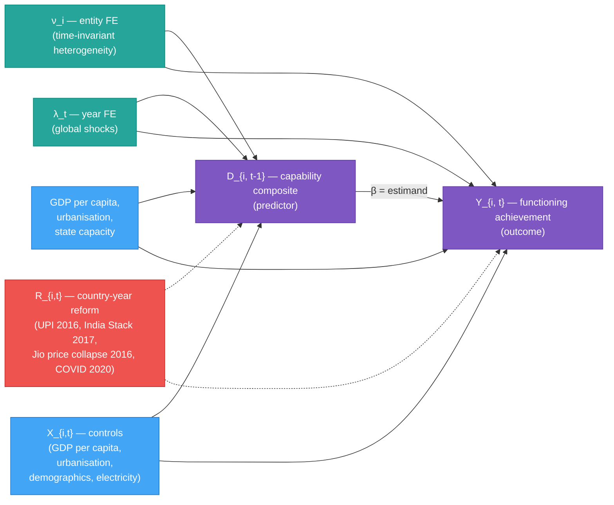

# DAG — Identification Strategy

The directed acyclic graph below operationalises the estimand stated in `04_identification_strategy_revised.md` §1. It is reproduced here so the dashboard can render it inline.

## Mermaid (rendered by the Streamlit dashboard)

## Reading the DAG

- **Solid arrows from controls** (entity FE, year FE, X) are paths the estimator closes.
- **Dotted arrows from R** are paths the estimator does **not** close. R is a country-year-specific reform that drives both D in the prior period and Y in the current period; two-way fixed effects do not absorb it.
- The **β arrow from D to Y** is the estimand defined in `04_identification_strategy_revised.md` §1.

## Why this matters for the current build

Construct contamination (predictor and outcome share constituent indicators) operates *additionally* to the DAG threats above. The DAG is correct only after the disjoint-source partition of `04_identification_strategy_revised.md` §3.4 is implemented. Until then, the published β is biased by both (a) the unclosed R-path and (b) construct overlap.

## How the dashboard uses this

The Causal Evidence tab embeds the mermaid block inline, with a one-paragraph explainer keyed to the threats listed in `04_identification_strategy_revised.md` §3 and a callout reading: "β = 0.624 should be read in light of these threats; see academic/04_identification_strategy_revised.md §5."
