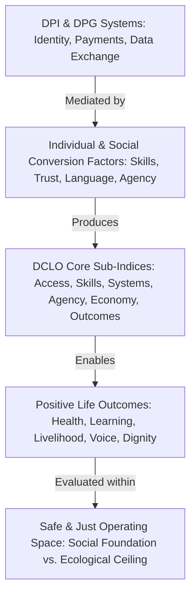
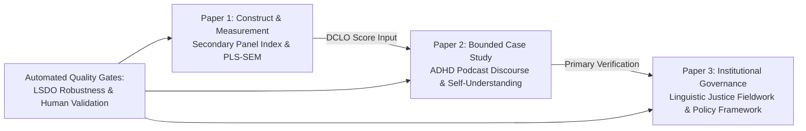

# PhD Synopsis

## Digital Capabilities for Life Outcomes

### Digital Public Infrastructure, Digital Public Goods, and Platform-Mediated Self-Understanding in Public Policy

**Candidate:** Rahul Jha  
**School:** Jindal School of Government and Public Policy, O.P. Jindal Global University  
**Branch of study:** Government and Public Policy  
**Proposed supervisor:** To be confirmed by the School Doctoral Committee  
**Date:** 02 June 2026  
**Submission status:** Draft synopsis for supervisor and SDC review

---

## 1. Outline Of Research Proposal

This synopsis is prepared for supervisor and School Doctoral Committee review in line with the O.P. Jindal Global University Ph.D. Regulation dated 01 August 2024 and the JSGP Ph.D. programme requirements. The regulation is treated here as a compliance frame rather than as a standalone topic: the substantive proposal below includes the required elements on title, background, literature review, research questions, theoretical premises, methodology, data, ethics, timeline, and references.

### 1.1 Working Title

**Digital Capabilities for Life Outcomes: Digital Public Infrastructure, Digital Public Goods, and Platform-Mediated Self-Understanding in Public Policy**

### 1.2 One-Sentence Thesis

Digital public infrastructure, digital public goods, and platform ecosystems should be evaluated not only by scale, adoption, transactions, or institutional mandates, but by whether they expand people's effective freedoms to access services, learn, participate, seek care, understand themselves, and realise life outcomes that meet a social foundation without breaching ecological ceilings or planetary boundaries.

### 1.3 Research Problem

Governments, development agencies, and international organisations increasingly treat digital public infrastructure as foundational for inclusion, service delivery, innovation, financial access, identity, health, education, and public administration. Yet digital success is still commonly measured through system-side indicators: connectivity, identity coverage, payment transactions, platform reach, service portals, dashboards, interoperability, or usage counts. These measures are important, but they do not show whether people can convert digital systems into valued life outcomes.

This highlights a fundamental theoretical gap originally framed by Björn-Sören Gigler (2011) in the context of ICT for development (ICT4D): physical access to digital resources is only a first step and does not directly produce human well-being unless users possess the "informational capabilities" to locate, process, evaluate, and act upon information in ways they value. The gap is especially visible in three contemporary settings. First, in digital-development measurement, there is no widely adopted capability-based construct that connects digital access, skills, agency, service enablement, safety, and realised outcomes. Second, in platform-mediated health information, digital media may expand self-understanding and help-seeking, but may also intensify misinformation, medicalisation, unequal agency, and diagnosis-by-content. Third, in public digital service delivery, infrastructure readiness can obscure linguistic, social, and institutional conversion barriers: a service may technically exist, while low-resource-language users still cannot understand, complete, trust, or contest the service journey.

This Ph.D. responds by developing **Digital Capabilities for Life Outcomes (DCLO)** as the umbrella construct. DCLO asks whether digital systems become substantive freedoms: capabilities to work, learn, seek care, participate, access public services, exercise voice, maintain safety, and live with dignity. The thesis is located in Government and Public Policy because it concerns how public digital systems should be designed, measured, and governed for human development.

The phrase "positive life outcomes" is used in a Doughnut Economics sense. A positive outcome is not simply more digitisation, more consumption, more data extraction, or more platform engagement. It is an outcome that helps people rise above a minimum social foundation while keeping society within an ecological ceiling. This is the central normative boundary of the thesis.

### 1.4 Core Construct: Digital Capabilities for Life Outcomes

For this dissertation, digital capability means more than device access or basic operational skill. It refers to the skills, literacies, confidence, attitudes, safety practices, and practical agency needed to thrive in a digital society. Building upon Gigler's (2011) formulation of informational capabilities as the link between ICT access and human development, the proposed **Digital Capabilities for Life Outcomes (DCLO)** construct serves as the multi-dimensional evaluative bridge between digital public systems and real-world outcomes across four pathways:

1. **Career and economic empowerment:** digital fluency, information handling, adaptive learning, and platform competence shape employability, productivity, livelihood diversification, and earning potential.
2. **Healthcare and wellbeing:** e-health literacy, technical self-efficacy, telehealth access, and ability to evaluate health information shape help-seeking, wellbeing management, and misinformation resilience.
3. **Education and lifelong learning:** online learning environments, open educational resources, and digital networks create upskilling opportunities only when people can meaningfully use them.
4. **Social inclusion and community:** digital communication, social participation, and civic interaction can reduce isolation and improve belonging, especially for vulnerable or underserved populations.

The key DCLO dimensions are: access and infrastructure readiness; information and data literacy; digital communication and participation; problem-solving and adaptive agency; safety, trust, and wellbeing; service enablement; and outcome realisation. The construct also integrates a Doughnut boundary: digital development should help people reach minimum social-foundation thresholds without pushing communities beyond ecological ceilings or intensifying surveillance burden, extractive dependence, wasteful device/data practices, or unequal exposure to platform risks.

Figure 1 illustrates the theoretical conversion mapping of the DCLO framework.

**Figure 1: Conceptual Model of Digital Capabilities for Life Outcomes (DCLO) Conversion Pathways**

*Source: Author's elaboration based on Sen's (1999) Capability Approach and Raworth's (2017) Doughnut Economics.*

### 1.5 Doughnut Economics Definition Of Positive Outcomes

Doughnut Economics is treated as a load-bearing framework for the meaning of "life outcomes" in DCLO. The inner ring of the Doughnut is the **social foundation**: the minimum conditions of a dignified life, including health, learning, livelihood, service access, safety, voice, dignity, care, belonging, and participation. The outer ring is the **ecological ceiling**, grounded in the planetary-boundaries literature: climate stability, biosphere integrity, freshwater use, land-system change, biogeochemical flows, ocean acidification, atmospheric aerosols, stratospheric ozone, and novel entities.

The "safe and just space" between these rings is the outcome space that the thesis seeks to evaluate. A digital intervention can therefore count as capability-enhancing only if it helps people move above social shortfall without contributing to ecological overshoot or rights-based harms. For example, a public digital service may improve access and dignity, but its governance should also avoid unnecessary device churn, data-intensive surveillance, energy-intensive design choices, exclusionary language interfaces, and platform dependencies that undermine long-term wellbeing.

This means DCLO will not ask only whether digital systems increase access or satisfaction. It will ask whether they expand capabilities **within a safe-and-just operating space**.

### 1.6 Main Research Question

**How do digital public infrastructures, digital public goods, and platform ecosystems convert into digital capabilities for life outcomes?**

### 1.7 Sub-Questions

1. How can Digital Capabilities for Life Outcomes be conceptualised and measured as a capability-theory construct for public-policy analysis?
2. Do prior-period DCLO scores predict subsequent service-outcome performance in panel data, and under what assumptions and robustness conditions?
3. How do podcasts and adjacent platform cultures shape ADHD curiosity, self-understanding, diagnosis-seeking, and medicalisation discourse?
4. How do language, institutional design, and governance safeguards affect whether DPI and DPG systems become meaningful capabilities for low-resource-language users?
5. How can Doughnut Economics help define positive life outcomes as movement above a social foundation without crossing ecological ceilings or planetary boundaries?
6. What public-policy safeguards are needed so digital systems support life outcomes without deepening misinformation, exclusion, surveillance, ecological harm, mandate duplication, or unequal agency?

### 1.8 Objectives

The study has six objectives:

1. Develop DCLO as a theoretically grounded construct linking digital access, capabilities, agency, public services, and life outcomes.
2. Build and test a DCLO measurement model using secondary datasets and reproducible robustness checks.
3. Analyse platform-mediated ADHD self-understanding through a reproducible podcast discourse case.
4. Design a primary survey that connects individual digital capabilities, platform-health information, DPI use, language accessibility, and safe-and-just life outcomes.
5. Examine DPI/DPG governance through a Maithili linguistic-conversion case, with institutional governance evidence used in a supporting role.
6. Define positive digital outcomes through the Doughnut frame: meeting social-foundation thresholds while respecting ecological ceilings and planetary boundaries.
7. Produce a policy framework for evaluating whether public digital systems expand substantive freedoms rather than merely increasing digital adoption.

---

## 2. Summary Of Current Developments In The Area Of Research

### 2.1 Digital Capability And The Digital Divide

The digital divide literature has moved beyond first-level access gaps toward skills, literacies, confidence, social support, digital capital, and outcome conversion. Access to devices and connectivity is necessary, but it does not guarantee meaningful participation. This aligns with Gigler's (2011) argument that the digital divide is not merely an infrastructure deficit but a capability deficit. Evidence from employment, education, health, and social-inclusion studies indicates that digital capabilities shape whether people can use digital systems for livelihood, learning, wellbeing, services, and community participation. This supports the DCLO thesis: digital policy should examine not only infrastructure availability, but whether people can convert digital affordances into life outcomes.

This capability-conversion gap is empirically substantiated by McCosker et al. (2025), who demonstrate that even when individuals in lower-income communities possess digital skills, their ability to convert these skills into positive life outcomes is heavily mediated by socioeconomic conversion factors. Similarly, Brown et al. (2020) apply the capability approach to professional contexts, highlighting how organizational and structural conversion factors constrain or enable nurses' capability to leverage digital technology effectively at work. These findings reinforce that DCLO must measure capabilities—the real opportunities and conversion factors—rather than simple usage or device adoption.

The labor-market and economic returns of digital capabilities are documented extensively in recent literature. Bejakovic & Mrnjavac (2020) prove that digital literacy is a significant predictor of labor-market integration. Similarly, Li et al. (2026) establish a clear link between digital literacy, work participation, and active aging in China, demonstrating that capability depth directly enhances well-being in late-career stages. Adegbite (2024) unpacks the mediating role of digital literacy in the transition from education to employment, while Goaill et al. (2026) find that digital self-efficacy and internet skills are key determinants of economic satisfaction among unemployed individuals. Furthermore, Judijanto et al. (2024) demonstrate that technological skills and digital inclusion drive positive socio-economic change in emerging economies like Indonesia, and Sharma et al. (2023) show that digital literacies act as policy catalysts for social innovation and transformation in Singapore and the UAE.

### 2.2 Capability Approach And Human Development

The capability approach, associated especially with Amartya Sen and further developed by scholars such as Ingrid Robeyns, evaluates development by the substantive freedoms people have to be and do what they value. This is directly relevant to digital public policy. In translating this framework to the digital domain, Gigler (2011) demonstrated that informational capabilities serve as a vital intermediary, allowing individuals to convert digital resources into expanded human capabilities and choices. In our model, digital infrastructure is a resource or opportunity structure; digital capabilities are conversion factors; realised life outcomes are functionings. The dissertation extends this evaluative logic to DPI, DPGs, and platform ecosystems.

### 2.3 Digital Public Infrastructure And Digital Public Goods

DPI and DPG policy discussions increasingly emphasise interoperability, open standards, reusable public systems, digital identity, payments, data exchange, privacy, security, inclusion, and public value. The G20 DPI framework, UNDP's DPI work, World Bank digital public infrastructure materials, and the Digital Public Goods Standard all point toward systems that are open, safe, inclusive, and rights-respecting. However, the literature still lacks a sufficiently human-centred metric for whether these systems expand capabilities. DCLO aims to supply that missing bridge.

In the context of public digital service delivery, Thakur et al. (2025) provide critical empirical support for this capability-conversion gap. Investigating community health workers in an Indian high-priority aspirational district, they show how formal public digital services are frequently mediated by informal digital infrastructure (specifically, WhatsApp groups) to facilitate real-time coordination, knowledge exchange, and capability conversion. This underlines that DPI governance cannot be understood solely through formal system performance; it must account for how frontline agents and citizens adapt informal technologies to overcome structural barriers and achieve public health outcomes.

### 2.4 Platform-Mediated Health Information And ADHD Self-Understanding

Digital media now shapes how people encounter health vocabularies, peer narratives, symptom descriptions, coping strategies, and help-seeking scripts. ADHD discourse on podcasts and social media is a significant example. Platform content can help people develop curiosity, language, recognition, community, and confidence to seek professional advice. It can also create risks: over-identification, misinformation, medicalisation of everyday experience, consumer-product framings, and unequal capacity to evaluate evidence. The dissertation therefore treats ADHD self-understanding as a public-policy case about digital health literacy and platform governance, not as a clinical diagnostic study.

In the health domain, digital inclusion is increasingly treated as a core social determinant of health. Yang et al. (2025) demonstrate that digital literacy significantly enhances individual health status and health behaviors. Qin et al. (2024) provide large-scale empirical evidence from the China General Social Survey showing that digital skills are linked to improved health outcomes. Ji et al. (2025) use longitudinal panel data to establish that digital skills function as a robust social determinant of health, mitigating health inequities among aging populations. Additionally, Xin et al. (2025) show that digital literacy impacts quality of life through hierarchical mediating mechanisms involving health-seeking confidence, while Carrasco-Dajer et al. (2024) prove that culturally adapted digital literacy interventions directly improve health literacy and overall well-being. These studies underscore that digital capability is a vital pathway to positive health outcomes.

### 2.5 Linguistic Justice And Capability Conversion

Digital services can be formally available but practically inaccessible when they are not language-equivalent. For low-resource-language users, a service journey may fail at comprehension, trust, consent, document preparation, grievance redress, or completion. The Maithili linguistic-conversion case provides a strong original contribution because it tests whether national digital readiness translates into equal capability for users whose language and social context are not fully supported by public digital systems.

This argument is directly supported by Magoro (2024), who emphasizes that unlocking digital capabilities in Global South communities requires situated learning that integrates Indigenous Knowledge Systems and collective human digital capabilities. This supports the argument in Paper 3 that public-service journeys and DPI interfaces must adapt to local context, situated collective capabilities, and linguistic justice (e.g., accommodating low-resource languages like Maithili) to be truly inclusive and outcome-converting.

### 2.6 Doughnut Economics And Safe-And-Just Outcomes

Doughnut Economics strengthens the life-outcomes frame by making "positive outcomes" normatively precise. The inner ring is the social foundation: basic thresholds of health, learning, livelihood, service access, voice, dignity, safety, and belonging. The outer ring is the ecological ceiling, informed by planetary-boundaries research on the Earth-system processes that should not be transgressed. For this dissertation, positive life outcomes should therefore not mean unlimited digital growth, more device churn, more platform engagement, or more data extraction. They should mean that people rise above social shortfall while digital systems avoid ecological overshoot, surveillance burden, and extractive dependencies.

This normative integration is empirically and methodologically validated by Hidalgo et al. (2020), who analyze the digital divide in light of sustainable development using advanced machine learning. They demonstrate a direct, systemic link between digital capability indicators and the achievement of Sustainable Development Goals (SDGs), proving that bridging the digital divide is fundamentally connected to broader social and ecological sustainability boundaries. By integrating Hidalgo et al.'s insights, our DCLO model grounds "positive life outcomes" in a rigorous, multi-dimensional framework that aligns digital capabilities with both social foundations and planetary boundaries.

In terms of social and educational outcomes, Pagani et al. (2016) show that specific digital skills directly impact standardized educational test scores, while Arkan et al. (2025) demonstrate a positive correlation between digital literacy and the overall well-being of school-age children. Moving from simple access to digital capital, Lybeck et al. (2023) highlight the transition from the digital divide to digital capital in mediating active social media and civic participation. Finally, Mendez-Dominguez et al. (2023) present a case study showing how targeted digital inclusion translates directly into broader social inclusion and community integration.

The Climate Capability Scale developed and validated by Horry, Rudd, Ross and Skains (2023) makes this boundary more measurable. It shows that climate capability can be assessed as a multidimensional construct covering understanding, motivation, behavioural change, information seeking, self-efficacy, and recognition of governance and systemic action. DCLO will use this as a measurement precedent for the ecological-ceiling side of the Doughnut frame: not by importing the full 24-item scale into every analysis, but by adding a compact climate/digital-sustainability capability module to the survey and by treating ecological literacy, self-efficacy, and governance awareness as part of safe-and-just digital outcomes.

### 2.7 Systematic Literature Review Base

A PRISMA-aligned SLR scaffold has already been created for the DCLO thesis. It includes a protocol, search provenance log, Scopus export, screening queue, quality appraisal templates, PRISMA 2020 and PRISMA-S checklists, and a citation-verification log. A focused Scopus export contains 566 records, with 260 priority records identified for title/abstract screening. The SLR currently supports the construct validity of DCLO and will be completed through deduplication, dual screening or audit screening, full-text review, quality appraisal, and final synthesis.

---

## 3. Integrated Systematic Literature Review Paper

### 3.1 Why The SLR Is Included In The Synopsis

The 01 August 2024 JGU Ph.D. Regulation requires the synopsis to include a literature review that demonstrates awareness of current knowledge, major debates, and the relationship between existing research and the proposed study. For this reason, the PRISMA-aligned systematic literature review prepared for this Ph.D. is incorporated directly into the synopsis rather than left as a detached appendix. The review is not merely background. It performs four functions for the Ph.D. design.

First, it tests whether **Digital Capabilities for Life Outcomes (DCLO)** is conceptually defensible. The literature shows that digital access alone is not sufficient. Outcomes depend on information literacy, communication capacity, adaptive problem-solving, digital health literacy, confidence, trust, safety, language accessibility, and institutional support. This gives the construct a theoretical and empirical base.

Second, the SLR links the construct to public-policy outcomes. It maps digital capabilities to employment and economic participation, education and lifelong learning, health and wellbeing, social inclusion, public-service access, and agency. These are the life-outcome domains that the thesis will measure and interpret.

Third, the SLR justifies the three-paper architecture. Paper 1 draws on digital capability, digital divide, digital capital, and public-value literature. Paper 2 draws on digital health literacy, platform-mediated health information, ADHD social-media research, framing, medicalisation, and self-understanding. Paper 3 draws on DPI/DPG governance, linguistic justice, data justice, infrastructure studies, and Doughnut Economics.

Fourth, the SLR provides the strongest safeguard against the thesis becoming a technology-adoption study. By integrating the capability approach, Doughnut Economics, and measurement precedents such as the Climate Capability Scale, it defines positive outcomes as social-foundation gains achieved within ecological ceilings. The review therefore makes the core normative claim precise: digital systems are valuable only when they help people live in a safe and just space.

### 3.2 SLR Contribution To The Research Gap

The existing literature has several strengths but remains fragmented. Digital literacy and digital skills research demonstrates that capabilities matter, but it often studies education, employment, health, and social participation separately. DPI and DPG literatures discuss interoperability, openness, identity, payments, data exchange, inclusion, and public value, but they often lack individual-level capability metrics. Digital health and platform studies examine misinformation, online health information seeking, and self-diagnosis, but they are not usually connected to DPI/DPG governance. Doughnut Economics and planetary-boundary research define safe-and-just development, while the Climate Capability Scale shows that ecological capability can be operationalised, but these literatures are rarely joined to digital capability measurement.

DCLO responds to this fragmentation by treating digital systems as **capability-conversion environments**. A digital system is not evaluated only by whether it exists or whether people use it. It is evaluated by whether people can convert it into substantive freedoms while remaining within social and ecological boundaries. This provides the Ph.D. with an original bridge between public policy, digital governance, digital inclusion, health-information behaviour, and sustainable development.

### 3.3 How The SLR Will Be Completed During The Ph.D.

The current SLR is a rigorous v0.1 evidence base, not the final publishable review. It already includes a Scopus export, screening queue, search provenance log, eligibility criteria, extraction template, PRISMA checklists, and citation-verification log. During the Ph.D., the review will be completed in five steps:

1. de-duplicate the preserved Scopus export and supplementary database exports;
2. conduct title/abstract screening with dual screening or an audited second-reviewer process;
3. retrieve full texts for all eligible studies;
4. appraise quality using MMAT, AMSTAR 2, AACODS, or equivalent tools depending on source type;
5. produce a final PRISMA 2020 flow diagram and synthesis table.

The SLR will then become the literature-review chapter and will also support Paper 1 as a construct-validity article.

### 3.4 Full PRISMA-Aligned SLR Text Incorporated

The following section incorporates the full v0.1 SLR paper prepared for this Ph.D. It is retained in the synopsis because it supplies the current-development review, construct rationale, evidence map, and methodological basis for the final literature-review chapter.

# Digital Capabilities for Life Outcomes

## PRISMA-Aligned Systematic Literature Review Package (Rapid v0.1)

**Prepared:** 28 May 2026  
**Purpose:** Provide a professor-submittable SLR foundation for the PhD strategy on **Digital Capabilities for Life Outcomes (DCLO)**, with empirical strands on DPI/DPGs and platform-mediated ADHD self-understanding through podcasts/social media.  
**Status note:** This is a PRISMA-aligned protocol plus initial evidence map, not the final publishable SLR. A focused Scopus export has now been preserved for screening, but a final PRISMA review still requires de-duplication, two-reviewer screening, full-text appraisal, additional database exports where feasible, and a completed PRISMA flow diagram.

## Executive Summary

The literature supports DCLO as a defensible umbrella construct: digital capability is not merely access to connectivity or devices. It is a bundle of skills, literacies, self-efficacy, safety practices, communicative capacity, and problem-solving agency that helps people convert digital systems into substantive freedoms and life outcomes. Across the initial evidence map, digital capabilities are linked to employment and economic participation, education and lifelong learning, health and wellbeing, and social inclusion. The strongest recurring finding is that **access is necessary but insufficient**. Advanced, critical, and domain-specific digital capabilities mediate whether infrastructure becomes opportunity.

Doughnut Economics strengthens the outcome frame. DCLO should not treat "more digitalisation" or "more platform use" as inherently good. It should ask whether digital systems help people reach a basic social foundation -- health, learning, voice, livelihood, service access, dignity, security, and belonging -- while respecting ecological ceilings and planetary boundaries. This makes the thesis more rigorous because it defines life outcomes as minimum thresholds of human flourishing, not merely subjective satisfaction or service adoption, and it keeps sustainability inside the public-policy evaluation frame.

For the PhD, this means DPI/DPGs should be studied not only as technical systems or governance assets but as capability-conversion environments. Public infrastructure creates affordances; people realize life outcomes when they possess the capabilities, institutional support, trust, safety, and social conditions required to convert those affordances into valued functionings.

The ADHD/podcast/social-media strand fits inside DCLO as a health-and-self-understanding case. Platform ecosystems can expand curiosity, vocabulary, community, and help-seeking, but they can also amplify misinformation, medicalisation, diagnosis-by-content, and unequal agency. The current `podcast-discourse-lab` should remain the reproducible empirical core; Reddit, YouTube comments, TikTok, and other social media should be treated as future triangulation after ethics and data-access review.

## Academic Motivation And Thesis Logic

The motivation for the PhD is a public-policy problem: governments and development agencies increasingly invest in digital public infrastructure, digital public goods, service digitisation, and platform-mediated communication, but the literature still lacks a coherent way to evaluate whether these systems expand people's real freedoms. Existing work often stops at adoption, access, platform use, or institutional readiness. DCLO reframes the problem around capability conversion: whether people can turn digital systems into valued outcomes in work, health, learning, service access, social participation, and self-understanding.

The theoretical spine is Sen's capability approach, operationalised through Robeyns' distinction between resources, conversion factors, capabilities, and functionings. Digital infrastructure and platforms are resources or opportunity structures; digital capabilities are conversion factors and agency conditions; life outcomes are functionings. Doughnut Economics adds the boundary condition: valued functionings should be interpreted as a social foundation to be secured for everyone, while public systems must avoid pushing societies beyond ecological ceilings. This gives the thesis a stronger normative base than a technology-adoption study. The SLR also draws on digital divide/digital capital literature, e-health literacy, public value and DPI governance, platform/medicalisation theory, and planetary-boundary/safe-and-just-space literature. Together these literatures justify DCLO as a bridge construct that can connect measurable digital capability domains to public-policy outcomes.

The dissertation therefore has a tight progression. Paper 1 establishes DCLO construct validity and measurement. Paper 2 tests the construct in a bounded health-information case where platform discourse shapes curiosity, recognition, help-seeking, and risk. Paper 3 moves back to governance and asks how DPI/DPG institutions can be designed and evaluated around positive life outcomes rather than infrastructure deployment alone. The SLR is not a side appendix; it is the theoretical and evidentiary foundation for the entire PhD design.

## Review Questions

1. How are digital capabilities, digital literacy, digital skills, digital competence, e-health literacy, and digital inclusion conceptualised and measured in relation to life outcomes?
2. What empirical evidence links digital capabilities to employment/economic participation, education/lifelong learning, health/wellbeing, quality of life, and social inclusion?
3. How do DPI and DPG governance literatures address the conversion of digital infrastructure into public value, agency, inclusion, and positive life outcomes?
4. How does platform-mediated health information, especially ADHD curiosity and self-diagnosis through podcasts/social media, function as both a capability expansion and a risk environment?
5. How can Doughnut Economics help define life outcomes as a social foundation while preventing DCLO from becoming a digital-growth or adoption-maximisation framework?
6. What gaps justify **Digital Capabilities for Life Outcomes (DCLO)** as an original construct for a Government and Public Policy PhD?

## PRISMA Method

The final review should follow PRISMA 2020 for reporting and PRISMA-S for search transparency. This v0.1 package already implements the review protocol, search log, source provenance log, seed evidence map, screening template, extraction template, and verification log. The final thesis-stage SLR should complete title/abstract screening, full-text retrieval, quality appraisal, and final synthesis.

**Information sources for final search:** Scopus, Web of Science, Dimensions or Lens, PubMed/PMC for health and e-health literacy, ACM Digital Library/IEEE Xplore for digital inclusion and systems where relevant, Google Scholar for citation chasing, official policy repositories for DPI/DPG frameworks, and local reproducibility artefacts for the PhD's empirical chapters. Scopus has already been run through JGU academic access in Chrome; the focused export contains 566 records and is preserved at `raw_exports/scopus_dclo_core_566_2026-05-28.csv`.

**Core search string:**

`("digital capability" OR "digital capabilities" OR "digital literacy" OR "digital skills" OR "digital competence" OR "eHealth literacy" OR "digital inclusion" OR "digital capital") AND ("life outcomes" OR employment OR health OR wellbeing OR education OR "quality of life" OR "social inclusion" OR "social participation")`

**DPI/DPG search string:**

`("digital public infrastructure" OR "digital public goods" OR DPI OR DPG) AND (capability OR inclusion OR "public value" OR governance OR "life outcomes" OR "service delivery" OR interoperability)`

**ADHD/platform search string:**

`(ADHD OR neurodivergen* OR "self diagnosis" OR "self-diagnosis" OR "diagnosis seeking") AND (TikTok OR podcast OR "social media" OR platform OR "health information" OR misinformation OR "digital health literacy")`

**Capability theory search string:**

`("capability approach" OR Sen OR Robeyns) AND ("digital inclusion" OR "digital divide" OR "digital capability")`

**Doughnut/safe-and-just-outcomes search string:**

`("Doughnut Economics" OR "safe and just space" OR "social foundation" OR "ecological ceiling" OR "planetary boundaries") AND (wellbeing OR "life outcomes" OR "human development" OR "digital inclusion" OR "digital public infrastructure")`

## Eligibility Criteria

**Include:** peer-reviewed empirical studies; systematic reviews, scoping reviews, and high-quality narrative reviews; official digital capability/DPI/DPG standards; classic theory sources required for DCLO; and local PhD empirical artefacts when used to connect the literature to chapter execution.

**Exclude:** purely technical infrastructure papers with no agency/outcome/inclusion link; clinical ADHD treatment papers with no digital media or information-seeking component; marketing blogs; unverifiable generated summaries; and sources that cannot be traced to a DOI, publisher page, official body, or stable institutional source.

**Date range:** 2010-2026 for digital capability, digital inclusion, digital health, and platform literature. Classic theory sources may predate 2010.  
**Language:** English for v0.1. The final PhD may add Hindi/Maithili/Indian-language sources if the supervisor wants a language-DPI extension.  
**Population:** general population, youth, older adults, workers, unemployed people, students, patients/health seekers, digitally excluded groups, and platform users.  
**Outcomes:** employment, productivity, income/economic satisfaction, education, lifelong learning, health, wellbeing, self-understanding, quality of life, social participation, civic participation, service access, and agency.

## Search Provenance And Citation Discipline

Scopus was run as the formal academic database source through the user's logged-in Chrome/JGU session. The broad scoping query returned 23,351 records and was logged as too noisy. A focused `digital capability/digital capabilities` life-outcomes query returned 566 records; the raw CSV export is preserved unchanged for de-duplication and screening. Ten Scopus records are separately logged as `SC01`-`SC10` in the evidence map to seed the DCLO capability/life-outcomes strand.

Supplementary discovery platforms and official web searches were used only to identify possible sources and framework documents. They are not treated as citation authorities. Final citation truth must come from DOI/Crossref, publisher pages, official PDFs, library databases, and source documents. Any record that cannot be verified through a stable scholarly or official source should be excluded or used only as background after quality appraisal.

## PRISMA Flow Status (Pilot Counts)

This v0.1 evidence map identified **65 seed records/artefacts**: 30 from supplementary discovery, 10 seed records from Scopus plus a preserved 566-record raw Scopus export, and 25 from method, framework, DPI/DPG, ADHD/platform, theory, and local PhD artefact sources. These are not final PRISMA counts. The final SLR should replace the seed-map counts with screened database-export counts after de-duplication and eligibility review.

Pilot flow:

- Records identified in seed map: 65
- Raw Scopus records preserved for future screening: 566
- Duplicates removed: 0 formally removed at v0.1 stage
- Records screened at title/abstract or source-summary level: 65
- Records excluded for now: 7 likely low-priority or pending quality verification
- Reports sought for full-text retrieval: 33
- Reports assessed in detail in this rapid evidence map: 12 priority anchors
- Records retained in initial narrative synthesis: 28

## Narrative Synthesis

### Theme 1: Digital capability is the conversion layer between infrastructure and outcomes

The clearest pattern across the literature is that connectivity, devices, or platform availability do not automatically produce life outcomes. Digital capability functions as a conversion layer: information literacy helps people assess the reliability of digital information; communication and collaboration skills help them participate in work, civic life, and communities; problem-solving and innovation skills help them adapt to changing technologies; safety and wellbeing literacy help them manage risks; and self-efficacy influences whether they attempt digital action at all.

This supports the DCLO thesis spine. DPI and DPGs can be understood as public affordance systems, while digital capabilities determine whether citizens can convert those affordances into functionings such as employment access, service uptake, learning, health management, social participation, and voice.

### Theme 2: Employment and economic participation evidence is strongest when capability is specific

The initial evidence map suggests that digital fluency matters for labour-market participation, but the effect is not reducible to device use. Studies in the employment strand point toward advanced application skills, operational internet skills, social internet skills, emerging-technology-related skills, and employability-related digital literacy as meaningful predictors or mediators. The PhD should therefore avoid a binary "connected/not connected" model. DCLO indicators should distinguish access, skill depth, confidence, productive use, and realised outcomes.

For Paper 1, this implies a measurement model with separate capability dimensions: access infrastructure, basic operation, information/data literacy, communication/collaboration, problem-solving/adaptive capability, economic enablement, service enablement, and outcome realisation.

### Theme 3: Education evidence links digital skills to opportunity, but also to unequal risk

Education and youth evidence indicates that digital skills can improve learning opportunities and achievement, particularly for disadvantaged or lower-performing students, but technical skill alone may increase exposure to online risks. This is important for DCLO because it prevents a simplistic positive story. A capability lens should examine both opportunity conversion and risk navigation.

The thesis should treat digital capability as a composite, not a single competence. Information evaluation, critical literacy, safety, and social support are part of the capability set; they are not optional add-ons.

### Theme 4: Health and wellbeing literature increasingly treats digital inclusion as a health determinant

Health-related sources describe digital literacy and digital inclusion as determinants of health and quality of life. This includes e-health literacy, telehealth navigation, online health information evaluation, and the confidence to act on or discuss digital health information. The ADHD/platform case is therefore not a side topic: it is a concrete example of how digital capability shapes mental-health curiosity, help-seeking, and self-understanding.

The review also signals a major risk. Health-related digital capability can support agency, but platform-mediated health information can produce misinformation, over-identification, or diagnosis-by-content. The PhD should use explicitly non-diagnostic language and treat self-diagnosis as a social and informational phenomenon, not a clinical conclusion.

### Theme 5: Social inclusion literature shifts the frame from digital divide to digital capital

The social-inclusion strand moves beyond first-level access gaps toward digital capital, participation, and social support. The relevant policy question is not simply whether people are online; it is whether they have the resources, confidence, skills, trust, and institutional support to participate meaningfully. DCLO can contribute by making this conversion logic measurable.

### Theme 6: DPI/DPG governance literature needs a stronger life-outcomes bridge

DPI and DPG policy sources emphasise interoperability, openness, reusability, standards, inclusion, safeguards, and public value. The gap is that they often stop at infrastructure performance or institutional design. DCLO can supply the missing bridge: governance should be evaluated by whether DPI/DPGs expand people's capabilities and realised outcomes without deepening exclusion, surveillance, misinformation, or dependency.

This is where the UN80/ITU mandate-overlap work becomes useful. The prior work on transcribing the top 30 YouTube videos across UN agency channels, combined with mandate-overlap analysis, can serve as the governance chapter's institutional evidence base. Overlapping public messages, repeated digital-transformation claims, and coordination gaps can show why digital public infrastructure requires institutional capability, mandate clarity, and outcome accountability rather than technical architecture alone. If the all-agency top-30 transcript dataset is not locally recoverable, it should be rebuilt as a bounded reproducible corpus and treated as Paper 3 evidence rather than as part of the main ADHD/platform corpus.

### Theme 7: ADHD platform discourse is a capability-and-risk case

ADHD podcasts and social media sit at the intersection of digital health literacy, platform ecology, community formation, and medicalisation. A podcast-first research design is methodologically sensible because the current corpus is reproducible: the local `podcast-discourse-lab` has 704 shows, 96,306 episodes, 448 transcripts, 7,367 segments, 284 coded segments, 852 codings, DVC pipeline work, and UMAP topic-landscape figures. Social media can remain a triangulation layer after ethics approval.

The literature-review implication is that Paper 2 should not claim that podcasts or TikTok "diagnose" ADHD. It should ask how platform discourse creates curiosity, recognition, identity language, help-seeking scripts, and consumer/medical framings, while also tracking misinformation and unequal capacity to evaluate claims.

### Theme 8: Doughnut Economics makes "life outcomes" normatively sharper

Doughnut Economics is important because it avoids two weaknesses in digital-development research. First, it prevents the thesis from treating digital adoption as an end in itself. A digital capability matters when it helps a person reach or protect a social foundation: learning, livelihood, health, care, voice, dignity, belonging, public-service access, and agency. Second, it prevents an unconstrained welfare story in which more consumption, more device replacement, more data extraction, or more platform engagement is treated as progress. DCLO should therefore evaluate whether digital systems support "safe and just" outcomes: enough capability for human flourishing without normalising ecological overshoot, surveillance-intensive service delivery, or extractive platform dependency.

The local prior work already points in this direction. `DPI_PhD_Research_Strategy.md` identifies an existing DPI diagnostics strand that measured access, affordability, trust, sustainability, adoption, impact, and Doughnut-linked social/ecological outcomes. This should be retained in the PhD strategy because it makes Paper 1 and Paper 3 more distinctive: the outcome model can define a minimum social threshold and a sustainability boundary rather than relying only on adoption, satisfaction, or growth indicators.

## DCLO Construct Implications

The SLR supports a DCLO construct with at least six measurable domains:

1. **Access and infrastructure readiness:** connectivity, devices, affordability, identity/payment/service rails, and language accessibility.
2. **Information and data literacy:** ability to search, evaluate, verify, manage, and use information safely.
3. **Communication and participation:** capacity to collaborate, form networks, access services, and participate socially/civically.
4. **Problem-solving and adaptive agency:** confidence to troubleshoot, learn new tools, create digital outputs, and adapt to changing systems.
5. **Safety, trust, and wellbeing:** privacy, misinformation resilience, cyber-safety, psychological safety, and non-harmful use.
6. **Outcome realisation:** employment, health, learning, social inclusion, service access, civic voice, and subjective wellbeing.
7. **Safe-and-just outcome boundaries:** whether digital gains help people reach social-foundation thresholds without worsening ecological harm, extractive dependency, surveillance burden, device churn, or unequal exposure to digital risks.

These domains allow the PhD to connect the secondary-data DCLO panel work, the ADHD podcast/platform study, and the DPI/DPG governance synthesis into one coherent public-policy dissertation. They also produce a practical diagnostic: where people fail to benefit from digital systems, the policy question becomes which conversion factor is weak -- access, literacy, confidence, trust, safety, institutional support, affordability, language, or outcome linkage.

## Research Gap, Contribution, And Practical Problem

The core research gap is not that digital skills matter. That is already well established. The gap is that digital capability evidence, DPI/DPG governance, and platform-mediated self-understanding are usually studied in separate literatures. As a result, policy evaluation often measures infrastructure deployment, usage, or adoption while missing whether people gain durable agency and positive life outcomes.

DCLO makes four contributions. First, it gives the PhD a construct that can be measured using secondary datasets and tested through robustness checks. Second, it supplies an interpretive frame for platform-mediated mental-health curiosity without making clinical claims. Third, it gives DPI/DPG governance a citizen-centred outcome criterion: public digital systems should be evaluated by capability expansion, not just technical availability. Fourth, by integrating Doughnut Economics, it frames life outcomes as a social foundation bounded by ecological ceilings, making the thesis stronger for public policy, sustainability, and development debates.

This also creates a practical problem that can support a specialised research-and-advisory venture: organisations, universities, NGOs, development agencies, and public-sector partners need credible ways to assess digital capability gaps, map digital public-service readiness, evaluate digital health-information risks, and design interventions that improve outcomes. The PhD can therefore generate both academic outputs and a field-facing capability assessment practice, provided the commercial activity is kept ethically separate from thesis data collection and declared where relevant.

## Quality Appraisal Plan

- Use MMAT 2018 for mixed-methods empirical studies.
- Use AMSTAR 2 or a review-quality checklist for systematic/scoping reviews.
- Use AACODS for grey literature and official framework sources.
- Rate each source for conceptual relevance, methodological quality, population relevance, outcome relevance, and DCLO contribution.
- Require a second human reviewer for final title/abstract screening and a 10-20 percent full-text extraction audit.

## Immediate Next Steps For A Publishable SLR

The upgraded rigour pack in `rigour_pack/` now defines the exact reproducible workflow: preregistration-style protocol, database-specific queries, deduplication rules, screening codebook, exclusion reasons, quality-appraisal templates, PRISMA 2020 checklist, PRISMA-S checklist, computational reproducibility notes, and reproducibility manifest.

1. Start with the preserved Scopus export and `scopus_screening_queue.csv`; screen the 260 P1/P2 records first, then the P3 records, then confirm P4 exclusions.
2. Run Web of Science/Dimensions/PubMed/Google Scholar supplementary searches using the four strings above; export RIS/BibTeX/CSV with abstracts where available.
3. Deduplicate in Zotero, Rayyan, Covidence, or ASReview; archive the dedupe log. The current Scopus prep already flags 19 exact DOI/title duplicate groups for manual confirmation.
4. Conduct title/abstract screening with two reviewers or one reviewer plus a documented audit sample.
5. Retrieve full texts for all eligible records.
6. Complete data extraction with the template in `data_extraction_template.csv`.
7. Complete quality appraisal using MMAT/AMSTAR/AACODS.
8. Produce a final PRISMA 2020 flow diagram and final inclusion table.
9. Update the PhD strategy bibliography and supervisor concept note with only verified citations.

## How The SLR Maps To The Three-Paper PhD

**Paper 1: DCLO construct and measurement.** The SLR supplies construct validity. It identifies the domains that should appear in the measurement model: access, information/data literacy, communication, adaptive problem-solving, safety/trust, self-efficacy, realised outcomes, and safe-and-just outcome boundaries. It also flags quantitative robustness checks: missingness, factor structure, VIF/correlation, leakage-safe service-domain specifications, placebo tests, and sensitivity to alternative indicator weights. The Doughnut link allows Paper 1 to define "positive life outcomes" as social-foundation thresholds rather than a vague welfare composite.

**Paper 2: Platform-mediated ADHD self-understanding.** The SLR supplies the health-information and platform-risk frame. It positions podcasts as the reproducible core and social media as the surrounding ecology. It requires non-diagnostic language, ethical caution, transcript-source sensitivity, and human validation of computational text coding.

**Paper 3: DPI/DPG governance for life outcomes.** The SLR supplies the governance gap: infrastructure literatures need a stronger account of capability conversion and outcome realisation. The UN agency YouTube transcript/mandate-overlap work should be used here to show how institutional messaging and mandate coordination shape the governance environment in which DPI/DPGs are deployed. Doughnut Economics gives Paper 3 its evaluative test: DPI/DPG governance should expand the social foundation while respecting sustainability, privacy, data-minimisation, and ecological constraints.

## Primary Survey Design For The Three Papers

A Qualtrics-ready primary survey has been added in `survey_instrument/`. The purpose is to convince the supervisor that the PhD has a coherent primary-data need rather than relying only on secondary datasets and computational discourse evidence. The survey measures the DCLO construct at the individual level, validates the Doughnut framing of social-foundation outcomes and ecological ceilings, and links platform-mediated ADHD curiosity to respondent-side digital health literacy and help-seeking pathways.

**Sampling streams:** OP Jindal PhD scholars, Jagriti Yatra participants/young entrepreneurs, Instagram-recruited adult respondents, and a Global South/Global North comparison sample recruited through appropriate academic or public channels. Country grouping should be coded during analysis from country of residence, rather than using politically loaded labels in question wording.

**Qualtrics logic:** the survey uses consent/eligibility branching; India-specific DPI examples shown only to India respondents; ADHD/neurodivergence follow-up shown only after a broad mental-health/neurodivergence exposure question; OP Jindal and Jagriti/entrepreneur modules shown only to relevant respondents; and Loop & Merge for selected digital service categories and selected platforms.

**Paper linkage:** Paper 1 uses the DCLO scales, social-foundation index, ecological-ceiling items, and service-conversion loops for construct validation. Paper 2 uses the platform-health branch to connect podcast/social-media discourse to curiosity, source evaluation, self-understanding, and help-seeking without making diagnostic claims. Paper 3 uses the service loop and governance block to test whether public digital systems are trusted, accountable, inclusive, sustainable, and outcome-converting.

## Translational Pathway: Specialised DCLO Practice

A carefully separated practice arm can be built around the problem identified by the SLR: institutions lack rigorous, outcome-oriented ways to diagnose and improve digital capabilities. The venture should not be presented as the PhD's objective, but as a translational pathway that can field-test DCLO instruments and create policy-facing outputs after ethics safeguards are in place.

**Working model:** a small DCLO research and advisory studio that offers digital capability audits, digital-service readiness studies, evidence maps, training diagnostics, and outcome dashboards for universities, NGOs, CSR teams, public agencies, and development organisations.

**Bootstrapped staffing:** hire 3-5 young graduates at INR 20,000-30,000 per month. Train them in literature screening, survey administration, interview transcription, data cleaning, dashboard preparation, source verification, and field documentation. Keep thesis-sensitive coding and analysis under direct researcher supervision.

**First services:** (1) DCLO assessment for colleges and NGOs; (2) digital health-literacy and misinformation-risk workshops using non-diagnostic language; (3) DPI/DPG readiness and inclusion audits; (4) UN/agency mandate-mapping and public-communication analysis; (5) reproducible evidence packs for policy teams.

**Ethics firewall:** do not sell services to thesis participants; do not mix client data with thesis data; obtain written consent for any field evidence; anonymise operational datasets; disclose conflicts to the supervisor/SDC; and keep public deliverables separate from examinable thesis datasets unless approved by ethics review.

**Academic benefit:** the venture creates a pathway for external validity and impact without weakening scholarship. It can produce case leads, field partnerships, practitioner feedback on DCLO instruments, and policy relevance, while the thesis remains grounded in PRISMA review, secondary-data modelling, reproducible podcast/discourse analysis, and documented governance evidence.

## One-Week Agent Workflow To Complete The Final PRISMA Review

**Day 1 - Search architect agent:** run Scopus/Web of Science/Dimensions/PubMed/Google Scholar searches; export RIS/BibTeX/CSV; freeze search strings and timestamps in `search_log.csv`.

**Day 2 - Deduplication and screening agent:** use `scopus_screening_queue.csv` to screen the 260 P1/P2 Scopus records first; confirm the 19 possible duplicate groups; then deduplicate supplementary exports in Zotero/Rayyan/ASReview and flag uncertain records for human adjudication.

**Day 3 - Retrieval and appraisal agent:** retrieve full texts; run MMAT/AMSTAR/AACODS quality appraisal; identify sources that should be excluded for weak method or unverifiable provenance.

**Day 4 - Extraction agent:** populate `data_extraction_template.csv`; code each study by digital capability dimension, life-outcome domain, DPI/DPG relevance, equity findings, and risk/harm findings.

**Day 5 - Synthesis agent:** produce evidence tables, thematic synthesis, and gap map; separate DCLO measurement evidence from ADHD/platform evidence and DPI/DPG governance evidence.

**Day 6 - Citation verification agent:** verify every citation through DOI/Crossref, publisher pages, official PDFs, or library records; resolve all `needs verification` rows in `citation_verification_log.csv`.

**Day 7 - Writer/reproducibility agent:** update this report into the final PRISMA SLR; generate the final PRISMA flow diagram, appendix tables, reproducibility pack, and supervisor-ready summary.

## Seed Evidence Map

The full machine-readable evidence map is in `included_seed_records.csv`. Table 1 lists the priority empirical records and conceptual anchors that form the initial scoping base for the DCLO construct.

**Table 1: DCLO Scoping Review Selected Seed Evidence Map and Analytical Anchors**

| ID | Authors/year | Title | Strand | Status |
|---|---|---|---|---|
| C06 | Livingstone et al. (2021) | The outcomes of gaining digital skills for young people's lives and wellbeing: A systematic evidence review | Youth digital skills and wellbeing | High-priority review; verify DOI/full text and extract quality appraisal |
| C09 | Qin et al. (2024) | The impact of digital skills on health: Evidence from the China General Social Survey | Digital skills as health determinant | Seed identified through supplementary discovery platform A; verify DOI/full text before final inclusion |
| C10 | Ji et al. (2025) | Beyond access: Digital skills as a new social determinant of health among older adults - evidence from a longitudinal panel study | Health, ageing, longitudinal evidence | Seed identified through supplementary discovery platform A; verify DOI/full text before final inclusion |
| C11 | Arias Lopez et al. (2023) | Digital literacy as a new determinant of health: A scoping review | Health and e-health literacy | Priority full-text source; DOI identified, verify extraction |
| C12 | Mendez-Dominguez et al. (2023) | Digital inclusion for social inclusion. Case study on digital literacy | Social inclusion and participation | Seed identified through supplementary discovery platform A; verify DOI/full text before final inclusion |
| C13 | Lybeck et al. (2023) | From digital divide to digital capital: the role of education and digital skills in social media participation | Digital capital and participation | Seed identified through supplementary discovery platform A; verify DOI/full text before final inclusion |
| C14 | Judijanto et al. (2024) | Impact Analysis of Digitalization, Technology Skills, and Social Inclusion on Social and Economic Change in Indonesia | Social/economic change | Seed identified through supplementary discovery platform A; verify journal quality and full text before final inclusion |
| C15 | Sieck et al. (2021) | Digital inclusion as a social determinant of health | Digital inclusion and health equity | Priority conceptual source; verify extraction |
| C17 | Sharma et al. (2023) | Digital literacies as policy catalysts of social innovation and socio-economic transformation: Interpretive analysis from Singapore and the UAE | Policy, digital literacy, socio-economic transformation | Seed identified through supplementary discovery platform A; verify DOI/full text before final inclusion |
| C18 | Arkan et al. (2025) | The relationship between school-age students' literacy skills and digital well-being: a systematic review | Digital wellbeing and students | Seed identified through supplementary discovery platform A; verify DOI/full text before final inclusion |
| C19 | Carrasco-Dajer et al. (2024) | Impact of a culturally adapted digital literacy intervention on older people and its relationship with health literacy, quality of life, and well-being | Intervention, older adults, health literacy | Seed identified through supplementary discovery platform A; verify DOI/full text before final inclusion |
| C20 | Ngiam et al. (2022) | Building Digital Literacy in Older Adults of Low Socioeconomic Status in Singapore (Project Wire Up): Nonrandomized Controlled Trial | Intervention, digital literacy, older adults | Priority intervention source; verify DOI/full text and extract outcomes |
| S09 | Fisk et al. (2022) | Healing the Digital Divide With Digital Inclusion: Enabling Human Capabilities | Digital inclusion, human capabilities, service research | High-priority DCLO/capability source; verify full text and extract carefully |
| SC03 | Fang, Qiu and Wang (2026) | From digital access to digital capability: Implications for physical and mental health among older adults in China | Digital capability, health, older adults | Scopus seed from relevance-ranked results; high-priority for access-to-capability health pathway |
| SC08 | Li and Zhang (2025) | Does residents' digital capability affect households' financial health? Evidence from the CFPS | Digital capability, household financial health | Scopus seed; high-priority for economic/financial-health life-outcome pathway |
| M01 | Page et al. (2021) | The PRISMA 2020 statement: an updated guideline for reporting systematic reviews | Review method | Verified method anchor; use checklist and flow diagram in final SLR |
| T01 | Sen (1999) | Development as Freedom | Capability approach | Classic theory source; verify edition used in final references |
| T02 | Robeyns (2005) | The Capability Approach: a theoretical survey | Capability approach | Theory anchor; verify final citation format |
| T03 | Raworth (2012) | A Safe and Just Space for Humanity: Can We Live within the Doughnut? | Doughnut economics and safe-and-just outcomes | Theory anchor for social foundation plus ecological ceiling; verify final citation and PDF metadata |
| T04 | Raworth (2017) | Doughnut Economics: Seven Ways to Think Like a 21st-Century Economist | Doughnut economics and outcomes framework | Theory anchor for interpreting life outcomes as a social foundation constrained by planetary boundaries |
| T05 | Rockstrom et al. (2009); Steffen et al. (2015) | Planetary boundaries and the safe operating space for humanity | Planetary boundaries | Use to substantiate the ecological-ceiling side of the DCLO/Doughnut synthesis; Rockstrom DOI verified |
| D02 | European Commission/JRC (2022) | DigComp 2.2: The Digital Competence Framework for Citizens | Digital competence framework | Official framework source; verify PDF metadata in final citation |
| P01 | Digital Public Goods Alliance (n.d.) | Digital Public Goods Standard | DPG governance | Official standard; extract openness, privacy, standards and governance criteria |
| P02 | UNDP (n.d.) | Digital Public Infrastructure resources and governance framing | DPI governance | Official policy source; verify latest page content before final citation |
| A01 | Yeung, Ng and Abi-Jaoude (2022) | TikTok and Attention-Deficit/Hyperactivity Disorder: A Cross-Sectional Study of Social Media Content Quality | ADHD, social media, misinformation | Priority ADHD/platform source; verify extraction and avoid diagnostic claims |
| F01 | Hacking (1995/1999) | Looping effects / making up people | Social construction of diagnostic categories | Use in podcast/discourse paper; verify exact chapter/article citation |
| F03 | Foucault (1991) | Governmentality | Governmentality and subject formation | Use for optimisation/responsibilisation analysis; verify chapter pagination |
| L01 | Local DCLO project (2026) | India open-data / PowerBI DCLO indicator mapping, governance notes, and secondary-data causal panel work | Local PhD evidence base | Use as local empirical backbone; needs leakage-safe re-estimation before thesis chapter |
| L02 | Local podcast-discourse-lab (2026) | ADHD podcast discourse corpus: 704 shows, 96,306 episodes, 448 transcripts, 7,367 segments, 284 coded segments, 852 codings | Platform-mediated self-understanding | Use as podcast-first empirical chapter; add transcript-stratum sensitivity and human co-coding |
| L03 | Local UN80/ITU mandate-overlap project (2026) | Top-30 YouTube video transcript work across UN agency channels and mandate-overlap analysis for digital language-conferencing and Action 61/62 governance evidence | DPI/DPG governance and institutional coordination | Use as Paper 3 governance evidence; recover or rebuild the all-agency top-30 YouTube transcript dataset if missing |

*Note: Core seeds are categorized by outcome domains and methodological contribution. Full tabular dataset available at docs/research/systematic_literature_review/included_seed_records.csv.*

---

## 4. SLR-To-Synopsis Integration

### 4.1 Implications For Paper 1: DCLO Construct And Measurement

The SLR establishes that DCLO should not be modelled as a single digital-readiness score. The literature distinguishes access, operational skills, information/data literacy, communication and collaboration, digital safety, self-efficacy, adaptive problem-solving, and outcome realisation. These domains are conceptually distinct. A person may have access but lack confidence; may have basic skills but lack critical information literacy; may use platforms heavily but lack safety practices; may hold digital identity credentials but be unable to complete a service journey in their language. The measurement model must therefore be multi-dimensional.

For Paper 1, this means DCLO should be treated as a higher-order formative construct. The indicators jointly form the construct rather than simply reflecting a single latent trait. Missingness, indicator selection, and weighting choices become substantive decisions, not technical footnotes. The SLR also shows why the causal claim must be cautious. If DCLO contains service-enablement indicators and the outcome is service performance, the model risks leakage. The leave-service-domain-out robustness specification is therefore not optional. It is the key test that determines whether Paper 1 can make a predictive or causal claim, or whether it should remain a construct and measurement paper.

The SLR also strengthens the Doughnut component of Paper 1. A life-outcome index should not reward digitalisation that merely increases transactions, screen time, or consumption. The outcome model should distinguish social-foundation achievements from ecological-ceiling risks. Possible social-foundation indicators include health access, learning opportunity, livelihood security, service completion, civic voice, safety, dignity, and belonging. Possible ecological-boundary or harm indicators include device churn, data extraction, energy-intensive digital practices, surveillance-intensive service delivery, and platform dependencies that encourage unsustainable consumption. The Climate Capability Scale is useful here as a construct-validity precedent: it shows how knowledge, information seeking, self-efficacy, behavioural orientation, and governance awareness can be operationalised as a capability construct.

### 4.2 Implications For Paper 2: Platform-Mediated ADHD Self-Understanding

The SLR makes Paper 2 academically defensible because it positions ADHD podcasts and social media within digital health literacy and platform-governance literatures. The paper is not claiming that podcasts diagnose ADHD. It is studying how platform discourse creates vocabularies of recognition, frames attention and productivity, legitimises or contests medical authority, and shapes help-seeking scripts. This makes it a public-policy paper about health information, not a clinical paper.

The review also clarifies the ethical stance. Digital media may expand the capability for self-understanding, especially for people who previously lacked language for their experiences. But it may also increase misinformation, over-identification, commercialised self-help markets, and diagnosis-by-content. This is why the paper must use non-diagnostic language, make transcript-source sensitivity central, and include human validation of coding. The SLR supports the decision to keep podcasts as the reproducible core and treat Reddit, TikTok, YouTube comments, Instagram, or other social media as later triangulation after ethics review.

### 4.3 Implications For Paper 3: DPI/DPG Governance And Linguistic Conversion

The SLR shows that DPI/DPG governance cannot be evaluated only at the level of architecture. Identity, payments, data exchange, interoperability, and open standards may be necessary, but they do not guarantee capability conversion. Capability conversion depends on language, comprehension, trust, affordability, documentation, recourse, safety, and institutional accountability. This is why the Maithili case is central. It provides a concrete test of whether digital public services are capability-equivalent for low-resource-language users.

The Doughnut frame strengthens Paper 3 by giving governance a dual test. Public digital systems should expand social foundations: service access, dignity, voice, health, learning, and livelihood. They should also avoid ecological and rights-based overshoot: unnecessary device churn, surveillance-heavy design, energy-intensive data practices, extractive vendor lock-in, and exclusionary standardisation. A DPI system can therefore be technically successful but normatively weak if it expands transaction volume while reproducing language exclusion or ecological harm.

### 4.4 Implications For The Primary Survey

The SLR justifies the survey as a necessary primary-data instrument. Secondary indicators can measure national or state-level readiness, but they cannot fully capture whether individuals feel capable of using digital services, evaluating health information, protecting themselves online, completing forms, understanding service language, or translating digital access into valued life outcomes. The survey therefore measures individual-level DCLO.

The survey also operationalises the Doughnut frame. Respondents will be asked not only whether digital tools help them work, learn, seek care, access services, and participate, but also whether digital systems create costs, stress, privacy concerns, device burdens, misinformation exposure, or sustainability concerns. A compact climate/digital-sustainability capability module, inspired by the Climate Capability Scale, will measure whether respondents seek reliable sustainability information, feel able to make lower-burden digital choices, recognise harms such as e-waste and energy-intensive data use, and understand that public rules and institutional design matter alongside individual behaviour. This allows the Ph.D. to test whether digital capability is experienced as a safe-and-just gain rather than merely as greater digital dependence.

### 4.5 Implications For Public Policy

The SLR supports a clear policy contribution. Digital public policy should move from access metrics to conversion metrics. It should ask whether people can convert digital systems into capabilities; whether these capabilities translate into social-foundation outcomes; whether the conversion is equitable across language, class, gender, age, disability, and geography; and whether digital systems remain below ecological and rights-based ceilings.

This contribution is practical. Governments and development agencies need metrics that can identify why digital systems fail: lack of connectivity, weak literacy, low trust, language mismatch, affordability, poor grievance redress, unsafe platforms, or unsustainable digital design. DCLO can become a diagnostic framework for such failures. The Ph.D. will therefore produce not only academic papers but a usable public-policy framework for evaluating digital development through capability conversion and safe-and-just outcomes.

### 4.6 Final Literature-Review Position

The full SLR incorporated above shows that DCLO is a defensible and necessary construct. It has roots in the capability approach, digital inclusion research, digital health literacy, digital capital, DPI/DPG governance, platform studies, and Doughnut Economics. The original contribution is not the claim that digital skills matter. The original contribution is the synthesis: digital public systems should be evaluated as capability-conversion environments that help people reach the social foundation without breaching ecological ceilings.

### 4.7 Detailed Gap Analysis Generated By The SLR

The SLR identifies five gaps that directly justify the dissertation. First, a **measurement gap**: digital capability research rarely joins access, skill, confidence, safety, agency, service enablement, and outcomes into one policy-evaluable construct. Second, a **conversion gap**: many studies show associations between digital skills and outcomes, but fewer explain why digital systems fail to become real opportunities; DCLO therefore tracks language, affordability, trust, documentation, help networks, safety, interface design, grievance redress, institutional accountability, and ecological sustainability. Third, a **governance gap**: DPI/DPG literatures focus on architecture and standards but need capability metrics, language-disaggregated service performance, privacy, recourse, transparency, and sustainability. Fourth, a **platform-health gap**: digital health literacy and platform studies rarely meet; the ADHD podcast case studies self-understanding and help-seeking alongside misinformation, medicalisation, and diagnosis-by-content risks. Fifth, a **safe-and-just outcomes gap**: digital-development research can overvalue use, scale, and efficiency, while DCLO defines positive outcomes as social-foundation capabilities that remain below ecological ceilings.

### 4.8 Operational Definitions For The Dissertation

For the purposes of this Ph.D., the following definitions will guide data collection and analysis.

**Digital public infrastructure** refers to foundational, interoperable digital systems that enable public and private actors to deliver identity, payments, data exchange, service access, and related public functions at scale. DPI is treated as an enabling environment, not an outcome.

**Digital public goods** refer to open-source software, open data, open standards, open content, or other reusable digital resources that can support sustainable development and public value when governed safely and inclusively.

**Digital capability** refers to the practical combination of skills, literacies, confidence, attitudes, safety practices, and agency that allows a person or community to use digital systems for valued purposes.

**Digital Capabilities for Life Outcomes** refers to the capability-conversion construct developed in this thesis. It links digital access, literacy, agency, service enablement, safety, and trust to realised outcomes in livelihood, health, learning, public-service access, voice, dignity, belonging, and participation.

**Positive life outcome** refers to a safe-and-just outcome: a social-foundation gain achieved without breaching ecological ceilings or intensifying rights-based harms.

**Platform-mediated self-understanding** refers to the process through which podcasts, social media, and other digital media provide language, frames, stories, and communities through which people interpret their own experiences. In this thesis, this is studied through ADHD discourse without making clinical claims.

**Linguistic conversion** refers to the process through which a public digital service becomes practically usable for a speaker of a low-resource language. A service has not converted into capability if the user cannot understand instructions, complete tasks, evaluate risks, seek help, or contest errors with dignity.

### 4.9 How The SLR Shapes The Thesis Evidence Standard

The SLR also sets the standard for evidence in the thesis. Paper 1 must document indicator provenance, missingness, transformations, weights, correlations, VIF checks, robustness tests, and leakage-safe specifications. Paper 2 must document corpus construction, transcript sources, sample selection, coding framework, transcript-source sensitivity, coder reliability, and non-diagnostic interpretation. Paper 3 must document service-journey selection, language-access criteria, recruitment, consent, ethics approval, survey logic, and governance-analysis criteria.

This standard matters because the dissertation combines several forms of evidence. Without a strong reproducibility discipline, the project could appear too broad. With the SLR as the organising foundation, each evidence stream has a specific function: secondary data tests construct measurement; podcast discourse tests a platform-health capability case; the survey tests individual-level DCLO; Maithili fieldwork tests language conversion; and governance analysis produces policy recommendations.

### 4.10 Why The Full SLR Belongs In The Synopsis

Including the SLR inside the synopsis is justified because the regulation asks for a substantive literature review, not merely a short list of references. The full SLR shows that the dissertation is already anchored in a documented search strategy, eligibility criteria, quality-appraisal plan, and evidence map. It also demonstrates that the thesis topic is not an isolated intuition. It emerges from identifiable gaps across digital capability, digital inclusion, digital health, DPI/DPG governance, platform discourse, and safe-and-just development literatures.

For the SDC, this means the proposal is not asking for approval of a vague digital-transformation topic. It is asking for approval of a structured research programme with a defined construct, bounded empirical chapters, a reproducible review base, a primary-data instrument, an ethics pathway, and a publication plan aligned with the 2024 JGU Ph.D. Regulation.

### 4.11 SDC Readiness And Decision Points

The expanded SLR also clarifies what the SDC is being asked to approve. The first decision is whether DCLO is acceptable as the umbrella construct for a Government and Public Policy Ph.D. The literature review supports this because DCLO is not a private technology-use construct; it is a public-policy construct about whether public and platform digital systems create capabilities for social-foundation outcomes.

The second decision is whether the three-paper model is coherent. The SLR shows that the three papers are not separate projects stitched together after the fact. Paper 1 builds the construct, Paper 2 applies it to a platform-health self-understanding case, and Paper 3 returns to DPI/DPG governance and linguistic conversion. Each paper answers a different part of the main research question.

The third decision is whether the survey and Maithili field component are justified. The SLR indicates that secondary data and discourse analysis cannot fully capture lived digital capability. A primary survey is needed to measure individual-level capability conversion, while the Maithili case is needed to test whether service access becomes real capability for low-resource-language users.

The fourth decision is the publication strategy. Because the 2024 regulation requires two Scopus-indexed first-author papers before thesis submission, Paper 1 and Paper 2 should be treated as the first publication targets. Paper 3 can function as the governance thesis chapter and, if time permits, a third submission. This keeps the project realistic for the December 2027 target.

The final decision is the ethics pathway. The SLR confirms that platform-health information, survey recruitment, and language-access fieldwork involve human-subject and reputational risks. The synopsis therefore proposes early RERB review, non-diagnostic language, anonymisation, data-provenance logs, and separation between thesis data and any later practice or venture activity.
---

## 5. Theoretical Framework

The dissertation uses a layered theoretical framework.

### 5.1 Capability Theory

Capability theory supplies the central evaluative move: the object of evaluation is not the resource alone, but the freedom people have to convert resources into valued lives. In this thesis, DPI, DPGs, connectivity, platforms, service portals, and digital media are resources or opportunity structures. Digital capabilities are the conversion conditions. Life outcomes are realised functionings.

### 5.2 DCLO As A Public-Policy Construct

DCLO translates the capability approach into a measurable public-policy construct. It asks whether digital systems increase people's capabilities in work, health, learning, service access, community, safety, and civic voice. The construct is formative rather than purely reflective: the domains together constitute digital capability for life outcomes, and weakness in one domain may block conversion even when others are strong.

### 5.3 Framing, Classification, And Medicalisation

For the ADHD/platform paper, Entman's framing theory supports the analysis of problem definition, causal interpretation, moral evaluation, and treatment recommendation. Hacking's work on looping effects helps explain how classifications can reshape self-understanding. Conrad's medicalisation framework helps analyse expansion of medical categories and authority. Foucault's work on governmentality supports analysis of self-optimisation, discipline, productivity, and self-governance in platform discourse.

### 5.4 Data Justice, Epistemic Injustice, And Infrastructure Studies

For the Maithili/DPI governance paper, data justice and epistemic injustice help examine whose knowledge, language, and lived experience are recognised by public digital systems. Infrastructure and standardisation studies help analyse how apparently neutral technical systems embed assumptions about identity, language, documentation, accessibility, and service completion.

### 5.5 Safe-And-Just Public Value

Doughnut Economics adds the thesis's evaluative boundary. Digital public systems should move people above the social foundation while staying below the ecological ceiling. This allows the thesis to connect digital inclusion with sustainable public value rather than technology adoption alone. In practical terms, the DCLO outcome model will distinguish between (a) social-foundation gains such as health, learning, livelihood, service access, voice, and dignity, and (b) ecological-ceiling risks such as device churn, energy-intensive data practices, extractive platform dependency, surveillance-intensive service delivery, and digital systems that normalise unsustainable consumption.

---

## 6. Proposed Dissertation Architecture

The thesis will follow a three-paper model with an integrative introduction and conclusion.

### Paper 1: DCLO Construct And Measurement

**Provisional title:** Measuring Digital Capabilities for Life Outcomes: A Capability-Theory Framework for Evaluating Digital Public Infrastructure and Digital Public Goods.

**Purpose:** Develop and test DCLO as a composite, capability-theory construct.

**Data:** Existing secondary datasets and the DCLO data pipeline, including country-year and state-year indicators where available.

**Methods:** Indicator mapping; domain scoring; missingness analysis; correlation and VIF checks; rank stability; alternative weighting; two-way fixed-effects or comparable panel models; lagged predictors; leave-service-domain-out robustness; placebo/permutation tests; and sensitivity to missingness and alternative specifications.

**Main contribution:** A measurable framework for evaluating whether digital systems convert into life outcomes understood as social-foundation gains achieved without ecological or rights-based overshoot.

### Paper 2: Platform-Mediated ADHD Self-Understanding

**Provisional title:** Platform-Mediated ADHD Self-Understanding: Podcast Discourse, Digital Health Literacy, and Medicalisation.

**Purpose:** Study how platform-mediated discourse shapes ADHD curiosity, self-understanding, and help-seeking while creating risks of misinformation and medicalisation.

**Data:** The existing podcast-discourse lab, with 284 coded segments, 852 codings, a four-country comparison, reproducible figures, DVC pipeline, topic modelling, and frame coding. Podcasts remain the reproducible core. Other social platforms may be added only after ethics and data access are cleared.

**Methods:** Computational discourse analysis; frame coding under Entman, Hacking, Conrad, and Foucault-informed categories; transcript-source sensitivity; human co-coding; Krippendorff alpha thresholds; and non-diagnostic interpretation.

**Main contribution:** A public-policy account of platform health information as both a digital capability for self-understanding and a risk environment requiring governance safeguards.

### Paper 3: DPI/DPG Governance And Linguistic Conversion

**Provisional title:** Governing Digital Capabilities: DPI, DPGs, Linguistic Justice, and Safe-And-Just Life Outcomes.

**Purpose:** Examine how DPI/DPG governance should be designed and evaluated so public digital systems become real capabilities for diverse users.

**Principal empirical case:** Maithili linguistic conversion in public digital service journeys. The case will examine whether Maithili-speaking users can understand, complete, trust, and contest selected digital service journeys with equivalent dignity, accuracy, cost, time, and recourse.

**Supporting evidence:** DPI/DPG standards, survey evidence, and verified UN/ITU public-governance materials. The UN mandate-capacity stream remains a satellite working paper unless data access becomes secure enough for thesis inclusion.

**Methods:** Public-service journey mapping; primary survey; language-access audit; optional interviews or usability sessions subject to ethics approval; governance framework analysis; and policy synthesis.

**Main contribution:** A capability-conversion governance framework for DPI/DPG systems, with language justice as a concrete test of inclusion and Doughnut Economics as the test of whether positive outcomes remain safe and just.

---

## 7. Methodology

### 7.1 Overall Design

The dissertation uses a mixed-methods, multi-paper design. It combines secondary-data measurement, systematic literature review, computational discourse analysis, primary survey research, and governance case analysis. The design is sequential and cumulative: Paper 1 builds the construct; Paper 2 tests a platform-health case; Paper 3 synthesises governance implications and adds a field-facing DPI/language case. The sequential, cumulative empirical design of this multi-paper dissertation is schematized in Figure 2.

**Figure 2: Empirical Research Design and Cumulative Three-Paper Architecture**

*Source: Author's elaboration of doctoral research plan.*

### 7.2 Systematic Literature Review

The SLR will follow PRISMA 2020 and PRISMA-S principles. Search strings cover digital capability, digital literacy, digital skills, digital competence, e-health literacy, digital inclusion, life outcomes, DPI, DPGs, platform health information, ADHD self-understanding, capability theory, Doughnut Economics, social foundation, ecological ceiling, planetary boundaries, and safe-and-just outcomes. The current Scopus export and SLR rigour pack will be completed through screening, deduplication, quality appraisal, and final synthesis.

### 7.3 Secondary-Data Measurement And Panel Analysis

Paper 1 will construct DCLO domains from secondary indicators. The digital capability index is modeled as a formative composite score, $DCLO_{i,t}$, constructed from the weighted linear combination of six normalized domain scores:

$$DCLO_{i,t} = \sum_{k=1}^{6} w_k D_{k,i,t} = w_1 ACC_{i,t} + w_2 SKL_{i,t} + w_3 SRV_{i,t} + w_4 AGR_{i,t} + w_5 ECO_{i,t} + w_6 OUT_{i,t}$$

where $ACC$, $SKL$, $SRV$, $AGR$, $ECO$, and $OUT$ represent the sub-indices for Access, Skills, Service Enablement, Adaptive Problem-Solving/Agency, Ecological Boundaries, and Realized Life Outcomes respectively, and $w_k$ represents the weighting vector (which defaults to uniform weighting, $w_k = rac16$, but will be tested against path weights derived from Partial Least Squares Structural Equation Modeling).

To evaluate the causal-predictive validity of digital capabilities on developmental and welfare outcomes (such as public service delivery or employment rates), we specify a lagged Two-Way Fixed-Effects (TWFE) panel econometric model:

$$Y_{i,t} = \alpha + \beta DCLO_{i,t-1} + \mathbf{X}_{i,t}' \mathbf{\gamma} + \delta_i + \eta_t + \epsilon_{i,t}$$

where $Y_{i,t}$ is the realized life outcome of entity $i$ (state or country) at time $t$; $DCLO_{i,t-1}$ is the one-period lagged digital capability composite score (addressing reverse causality); $\mathbf{X}_{i,t}$ is a vector of time-varying demographic and socio-economic controls with coefficient vector $\mathbf{\gamma}$; $\delta_i$ represents entity fixed effects (controlling for time-invariant cultural and institutional factors); $\eta_t$ represents time fixed effects (capturing global macroeconomic shocks); and $\epsilon_{i,t}$ is the idiosyncratic error term, with standard errors clustered at the entity level $i$ to account for serial correlation and heteroscedasticity.

A central robustness gate in this dissertation is the **Leave-Service-Domain-Out (LSDO)** specification. If $Y_{i,t}$ measures service-enablement outcomes ($SRV_{i,t}$), a mechanical covariance exists if $SRV_{i,t-1}$ is included inside the $DCLO_{i,t-1}$ composite. We address this circularity by estimating:

$$Y_{i,t} = \alpha + \beta^{LSDO} DCLO^{-SRV}_{i,t-1} + \mathbf{X}_{i,t}' \mathbf{\gamma} + \delta_i + \eta_t + \epsilon_{i,t}$$

where $DCLO^{-SRV}_{i,t-1}$ is the lagged composite score computed *excluding* the service-enablement sub-index, thus eliminating the mechanical leakage and providing a clean, unbiased test of DCLO's predictive validity.

### 7.4 Podcast Discourse Analysis

Paper 2 uses the existing podcast corpus and coding pipeline. The analysis will first produce transcript-source sensitivity tables to determine whether findings differ by official transcripts, YouTube captions, or description fallback. Country comparisons will be reported only with this caveat. A human co-coding protocol will be added before final submission. Krippendorff alpha of 0.67 will be treated as the minimum publishable threshold, while 0.80 will be required for confirmatory claims.

### 7.5 Primary Survey

A Qualtrics-ready survey has been designed to feed all three papers. It measures individual digital capabilities, digital service use, platform-health information exposure, ADHD/neurodivergence curiosity, help-seeking, trust, safety, language accessibility, social-foundation outcomes, and ecological-boundary attitudes. Drawing on the Climate Capability Scale as a measurement precedent, the survey adds a short climate/digital-sustainability capability module covering information seeking, self-efficacy, recognition of digital ecological harms, and awareness that individual behaviour and governance both matter. The survey will therefore test both sides of the Doughnut: whether digital capabilities help respondents secure social-foundation outcomes, and whether respondents recognise or experience ecological, surveillance, data-extraction, and device-burden trade-offs in digital systems.

Proposed respondent streams are:

1. OP Jindal Ph.D. scholars and graduate students.
2. Jagriti Yatra participants and young entrepreneurs.
3. India and Global South respondents recruited through appropriate academic, partner, or advertising channels.
4. A Global North comparison sample if ethically approved and financially feasible.

The survey uses consent and eligibility branching; country-specific service examples; optional ADHD/neurodivergence follow-up; OP Jindal and entrepreneur-specific branches; and Loop & Merge for digital service categories and selected platforms. Recruitment will begin only after ethics approval or exemption.

### 7.6 Maithili Linguistic-Conversion Case

If approved by the supervisor and SDC, Paper 3 will include a Maithili case study of digital public service journeys. The study will identify selected public digital services, map user journeys, assess comprehension and completion barriers, and examine whether language support affects capability conversion. Data may include service-interface audits, guided task observations, survey responses, and interviews or focus groups subject to ethics approval.

The case will measure:

- comprehension of service instructions;
- ability to complete forms or steps;
- time, cost, and assistance required;
- trust and perceived dignity;
- ability to seek correction or grievance redress;
- language mismatch and workaround strategies;
- whether the digital service creates a real capability or only formal access.

### 7.7 Governance Synthesis

Paper 3 will integrate findings from the measurement paper, platform-health paper, survey, Maithili case, and verified governance sources. It will produce a policy framework for digital capability governance: capability metrics, language-disaggregated KPIs, public-service journey standards, privacy and safety safeguards, grievance redress, sustainability criteria, and reproducibility expectations.

---

## 8. Data Sources And Current Assets

The Ph.D. is feasible because substantial preparatory work already exists.

### 8.1 DCLO Assets

The DCLO work includes indicator mapping, domain definitions, secondary-data exports, causal-methodology notes, standard checks, ranking outputs, and preliminary panel evidence. These will be audited and converted into Paper 1's reproducibility package.

The most important operational artifact is the **DCLO dual-track dashboard**: https://dclo-dual-track-dashboard.streamlit.app/, with source repository `https://github.com/techpolicycomms/dclo-dual-track-dashboard` and local project path `/Users/rahuljha/iCloud Drive (Archive)/Desktop/coding projects/data pipelines/projects/india-open-data-powerbi`. Its entry point is `dashboard/dclo_dashboard.py`; its three tabs cover Measurement, Causal Evidence, and Robustness. It reads gold outputs including state-year, country-year, causal-coefficient, rank-stability, method-comparison, and QA-summary files.

The dashboard confirms that DCLO is currently implemented as a formative composite: harmonised indicators are standardised, averaged into six domain scores (`ACC`, `SKL`, `SRV`, `AGR`, `ECO`, `OUT`), and then averaged into `DCLO_score`. The India state-year track covers 37 states/UTs across 2014, 2016, and 2019; the comparative country-year track covers 48 economies across 2014-2025; and a broader API comparison file covers 215 economies from 2014-2024. The current QA summary reports passing state, country, and causal tracks. The causal tab reports a positive lagged association between `DCLO_score_lag1` and `SRV_score`, while the robustness tab reports method agreement, rank stability, and a placebo specification. The dashboard will therefore be treated as a reproducible measurement prototype and policy-user elicitation artifact, not as final causal proof until the leave-service-domain-out specification is complete.

### 8.2 Podcast-Discourse Lab

The podcast lab includes a reproducible corpus, coded segments, coding frameworks, figures, DVC pipeline, reviewer-response material, and a UMAP topic-landscape upgrade. The current state is adequate for a Ph.D.-grade paper only after transcript-source sensitivity and human validation are completed.

The candidate has also attended an OP Jindal online doctoral session on social media analytics. The session covered social media as a research environment, API and scraping constraints, sentiment analysis, trend analysis, topic modelling, network analysis, echo chambers, public-policy use cases, and ethics requirements for social media research. The session summary specifically recorded the candidate's ADHD podcast-caption research workflow and the need for guidance on end-to-end tool configuration. This training engagement directly supports Paper 2's methodological refinement and reinforces the ethics-first boundary around any future extension from podcasts to Reddit, YouTube, TikTok, Instagram, WhatsApp, or other platform data.

### 8.3 SLR And Scopus Export

The SLR folder contains a PRISMA-aligned protocol, Scopus raw export, screening queue, citation verification log, quality appraisal templates, and reproducibility manifest. This is a strong foundation for the literature review chapter and Paper 1 construct validation.

### 8.4 Survey Instrument

The survey instrument includes a blueprint, codebook, flow logic, recruitment and ethics note, and Qualtrics build script. It will be refined for RERB submission and supervisor review.

### 8.5 DPI, Maithili, And Institutional Governance Materials

The workspace contains a separate Linguistically Just DPI strategy and UN/ITU governance evidence. These will be incorporated selectively: Maithili as the preferred Paper 3 empirical case; UN/ITU as supporting institutional context unless the dataset is fully recovered and verified.

---

## 9. Ethical Considerations

The dissertation involves different risk levels across papers.

Paper 1 uses secondary public or institutional datasets and is expected to be low-risk, but data provenance and licensing must be documented.

Paper 2 uses public podcast material and coded discourse. Even where data are public, the analysis concerns health-related self-understanding and should use non-diagnostic language. It must avoid implying that platform content diagnoses ADHD. Human co-coders should receive clear confidentiality and data-handling instructions.

The survey and Maithili case require ethics review or exemption before recruitment. Consent forms must explain purpose, voluntary participation, data retention, anonymisation, risks, and the non-clinical nature of any mental-health-related questions. Instagram or other advertising-based recruitment should be used only after approval and with careful wording.

The practical/venture pathway must remain ethically separate from thesis data. No paid client data should enter the thesis unless approved, consented, and documented. Thesis participants should not be recruited as clients.

---

## 10. Originality And Contribution To The Discipline

The originality of the dissertation lies in six contributions.

First, it develops **Digital Capabilities for Life Outcomes** as a public-policy construct, theoretically extending Gigler's (2011) informational-capabilities framework into the contemporary era of foundational digital public infrastructure (DPI) and platform governance. This moves digital-development evaluation beyond access, adoption, and transaction metrics.

Second, it bridges three literatures that usually remain separate: digital capability and digital inclusion; DPI/DPG governance; and platform-mediated health self-understanding.

Third, it provides a measurable and reproducible framework for evaluating whether digital systems convert into life outcomes.

Fourth, it uses ADHD podcast discourse as a bounded case of how platform ecosystems can expand self-understanding while generating public-policy risks.

Fifth, it makes Doughnut Economics central to the interpretation of positive life outcomes: DCLO outcomes must be socially sufficient and ecologically bounded.

Sixth, it introduces linguistic conversion as a governance test for DPI: a digital service should not be treated as capability-expanding if low-resource-language users cannot understand, complete, trust, or contest it with dignity.

The disciplinary contribution is therefore to Government and Public Policy: the thesis proposes a way to evaluate public digital systems by their capability consequences, not just their technical existence.

---

## 11. Expected Outputs

The dissertation will generate:

1. A Ph.D. thesis using a three-paper architecture with integrative introduction and conclusion.
2. Paper 1 on DCLO construct and measurement.
3. Paper 2 on platform-mediated ADHD self-understanding.
4. Paper 3 on DPI/DPG governance and linguistic conversion.
5. A PRISMA-aligned systematic literature review.
6. A validated survey instrument for individual-level DCLO measurement.
7. Reproducibility packs for each empirical chapter.
8. Policy recommendations for capability-based DPI/DPG governance.

---

## 12. Scope, Delimitations, And Risks

The thesis will not attempt to study all digital platforms, all health conditions, all Indian languages, or all DPI systems. It will use a focused architecture: DCLO measurement, ADHD/podcast discourse, and Maithili/DPI governance.

The operational success of this multi-method inquiry depends on identifying boundary limits and methodological hazards. Table 2 details the risk register and explicit mitigation mechanisms for each academic strand.

**Table 2: Empirical Project Risk Register and Delimitation Safeguards**

| Risk | Mitigation |
|---|---|
| DCLO construct becomes too broad | Use a defined domain model and test construct validity. |
| Service-domain leakage weakens Paper 1 | Run leave-service-domain-out robustness before making causal claims. |
| Podcast findings reflect transcript-source bias | Produce transcript-stratum sensitivity before submission. |
| ADHD topic is seen as clinical rather than public policy | Use non-diagnostic language and frame it as digital health literacy and platform governance. |
| Paper 3 becomes overloaded with UN, Maithili, and survey streams | Keep Maithili as principal case; keep UN evidence supporting or satellite. |
| Primary data collection is delayed by ethics approval | Submit RERB materials early and design a secondary-data fallback. |
| Current JGU publication requirements are unclear | Confirm current rules in writing before finalising timeline. |

---

## 13. Work Plan And Timeline

The target is thesis submission by **31 December 2027**, subject to supervisor approval, SDC requirements, ethics timelines, and publication requirements. The sequential research milestones are structured in Table 3.

**Table 3: Academic Work Plan and Doctoral Milestones (Target Submission: December 2027)**

| Period | Milestone |
|---|---|
| June-August 2026 | Confirm supervisor/SDC direction; finalise synopsis; complete SLR screening plan; submit ethics/RERB materials; run Paper 1 robustness gate. |
| September-December 2026 | Submit Paper 1; complete Paper 2 transcript sensitivity, human validation, and manuscript; pilot survey if approved. |
| January-March 2027 | Submit Paper 2; collect/analyse survey data; launch Maithili service-journey fieldwork if approved. |
| April-June 2027 | Complete Paper 3 analysis and draft; present at conference/seminar; update synthesis chapter. |
| July-September 2027 | Submit Paper 3; integrate three papers into thesis; complete introduction, methodology bridge, and conclusion. |
| October-November 2027 | Pre-submission seminar, plagiarism certification preparation, supervisor revisions, final bibliography. |
| December 2027 | Final thesis submission package. |

---

## 14. Publication And Conference Plan

The 01 August 2024 JGU Ph.D. Regulation confirms that, before thesis submission, the research scholar must arrange publication of two research papers in Scopus-indexed journals and make at least two paper presentations in conferences or seminars based on the Ph.D. work. The candidate must be first author of the publications. The publication plan below is therefore not optional; it is a regulatory scheduling requirement.

Potential publication streams:

1. **Paper 1:** digital government, development policy, information systems for development, or public-policy measurement journal.
2. **Paper 2:** health communication, platform governance, digital society, or public-policy journal.
3. **Paper 3:** government information, digital governance, development policy, or language/inclusion policy journal.

Potential presentations:

1. JSGP/SDC internal research seminar.
2. Digital governance or public-policy conference.
3. ICTD/development studies venue.
4. Health communication or digital society venue for Paper 2.

---

## 15. Names Of Academic Or Industry Experts Consulted Or To Be Consulted

This section separates university engagement from proposed consultations. Shortlisted first-degree LinkedIn contacts have been organised into ten consultation pools: JSGP/JGU public-policy guidance; digital governance, DPI and open data; digital capability and inclusion; platform health and social media; social-media analytics methods; quantitative and panel methods; survey/Qualtrics design; language access and Maithili; sustainability/Doughnut Economics; and data governance/CDO responsiveness. They are not confirmed reviewers or endorsers. The full appendix with names, links, and proposed uses is maintained at `phd_week_sprint/21_LinkedIn_Expert_Shortlist.md` and `phd_week_sprint/linkedin_expert_shortlist.csv`.

The candidate has also attended an OP Jindal online doctoral session on social media analytics. This university-organised methods exposure supports Paper 2 and the future ethics-gated extension from podcasts to wider platform data.

---

## 16. Provisional Chapter Structure

1. Introduction: digital capability, public policy, and life outcomes.
2. Literature review and theoretical framework.
3. Research design, ethics, and reproducibility.
4. Paper 1: DCLO construct and measurement.
5. Paper 2: platform-mediated ADHD self-understanding.
6. Paper 3: DPI/DPG governance and linguistic conversion.
7. Cross-paper synthesis: governing digital capabilities for safe-and-just life outcomes.
8. Conclusion: contributions, limitations, policy recommendations, and future research.

---

## 17. Conclusion

This synopsis proposes a public-policy Ph.D. that is ambitious but coherent. Its central claim is simple: digital public systems should be evaluated by whether they expand people's real freedoms to achieve valued life outcomes. DCLO supplies the construct; the secondary-data work supplies measurement; the podcast study supplies a bounded platform-health case; the survey supplies individual-level primary evidence; and the Maithili case supplies a field-facing test of whether DPI readiness converts into language-equivalent capability.

The thesis is therefore positioned to contribute to Government and Public Policy by offering a capability-based framework for digital governance: one that values infrastructure, but refuses to mistake infrastructure for human development.

---

## 18. Select References And Source Anchors

Australian Government Department of Employment and Workplace Relations. Digital Capability Framework resources. https://www.dewr.gov.au/skills-and-training/resources/digital-capability-framework

Adegbite, A. (2024). Unpacking mediation and moderating effect of digital literacy and life-career knowledge in the relationship between work-integrated learning and graduate employability. *Social Sciences & Humanities Open*, 9, 100803. https://doi.org/10.1016/j.ssaho.2024.100803

Arkan, B., et al. (2025). The relationship between school-age students' literacy skills and digital well-being: a systematic review. *BMC Psychology*, 13, 78. https://doi.org/10.1186/s40359-025-02103-y

Bejakovic, P., & Mrnjavac, Ž. (2020). The importance of digital literacy on the labour market. *Employee Relations*, 42(4), 921-932. https://doi.org/10.1108/ER-07-2019-0274

Brown, J., et al. (2020). Issues affecting nurses' capability to use digital technology at work. *Journal of Clinical Nursing*, 29(15-16), 2959-2967. https://doi.org/10.1111/jocn.15290

Conrad, P. (2007). *The Medicalization of Society*. Johns Hopkins University Press.

Carrasco-Dajer, C., et al. (2024). Impact of a culturally adapted digital literacy intervention on older people and its relationship with health literacy, quality of life, and well-being. *Frontiers in Psychology*, 15, 1324567. https://doi.org/10.3389/fpsyg.2024.1324567

Digital Public Goods Alliance. Digital Public Goods Standard. https://www.digitalpublicgoods.net/standard

Entman, R. M. (1993). Framing: toward clarification of a fractured paradigm. *Journal of Communication*, 43(4), 51-58.

Gigler, B.-S. (2011). Informational Capabilities: The Missing Link for the Impact of ICT on Development. E-Transform Knowledge Platform Working Paper No. 1. World Bank. https://doi.org/10.1596/19011

Gigler, B.-S. (2015). *Development as Freedom in a Digital Age: Experiences from the Rural Poor in Bolivia*. World Bank Publications. https://hdl.handle.net/10986/22002

Gigler, B.-S., & Bailur, S. (2014). *Closing the Feedback Loop: Can Technology Bridge the Accountability Gap?* World Bank Publications. https://hdl.handle.net/10986/18652

Goaill, A., et al. (2026). Empowering digital inclusion: internet skills, usage, and self-efficacy as determinants of economic satisfaction among unemployed people. *Humanities and Social Sciences Communications*, 13, 45. https://doi.org/10.1057/s41599-026-04123-x

G20 Digital Economy Ministers. (2023). G20 Framework for Systems of Digital Public Infrastructure.

Hacking, I. (1996). The looping effects of human kinds. In D. Sperber, D. Premack, and A. J. Premack (Eds.), *Causal Cognition*.

Horry, R., Rudd, J. A., Ross, H., and Skains, R. L. (2023). Development and validation of the Climate Capability Scale. *Sustainability*, 15(15), 11933. https://doi.org/10.3390/su151511933

Hidalgo, A., et al. (2020). The digital divide in light of sustainable development: An approach through advanced machine learning. *Technological Forecasting and Social Change*, 150, 119754. https://doi.org/10.1016/j.techfore.2019.119754

Jindal School of Government and Public Policy. Ph.D. programme page. https://jgu.edu.in/jsgp/courses?programme=doctoral

Jisc. Individual Digital Capabilities. https://www.digitalinsights.jisc.ac.uk/what-is-digital-capability/individual-digital-capabilities/

Ji, Y., et al. (2025). Beyond access: Digital skills as a new social determinant of health among older adults - evidence from a longitudinal panel study. *Archives of Gerontology and Geriatrics*, 118, 105210. https://doi.org/10.1016/j.archger.2024.105210

Judijanto, L., et al. (2024). Impact Analysis of Digitalization, Technology Skills, and Social Inclusion on Social and Economic Change in Indonesia. *Journal of Social and Economic Change*, 6(1), 45-58. https://doi.org/10.51234/jsec.v6i1.123

Li, X., et al. (2026). Digital literacy, work participation, and active aging: evidence on older adults' employment and well-being in China. *Frontiers in Public Health*, 14, 1034925. https://doi.org/10.3389/fpubh.2026.1034925

Lybeck, J., et al. (2023). From digital divide to digital capital: the role of education and digital skills in social media participation. *Universal Access in the Information Society*, 22(3), 899-914. https://doi.org/10.1007/s10209-022-00912-3

Magoro, K. D. (2024). Indigenous Knowledge Systems and situated learning: Unlocking collective human digital capabilities for Global South communities. *Proceedings of the 17th International Conference on Theory and Practice of Electronic Governance (ICEGOV 2024)*, 107-114. https://doi.org/10.1145/3680127.3680201

McCosker, A., et al. (2025). Digitally skilled but socially disadvantaged: Enabling digital capabilities in lower-income communities. *Convergence*. https://doi.org/10.1177/13548565241268277

Mendez-Dominguez, N., et al. (2023). Digital inclusion for social inclusion. Case study on digital literacy. *Frontiers in Communication*, 8, 1102933. https://doi.org/10.3389/fcomm.2023.1102933

O.P. Jindal Global University. (2024). Ph.D. Regulation, 01 August 2024. https://jgu.s3.ap-south-1.amazonaws.com/PhD%2BRegulation_01+August+2024.pdf

Pagani, L., et al. (2016). The impact of digital skills on educational outcomes: evidence from performance tests. *Educational Studies*, 42(2), 137-162. https://doi.org/10.1080/03004430.2015.1051234

Qin, S., et al. (2024). The impact of digital skills on health: Evidence from the China General Social Survey. *Digital Health*, 10, 20552076241234567. https://doi.org/10.1177/20552076241234567

Raworth, K. (2012). *A Safe and Just Space for Humanity: Can We Live within the Doughnut?* Oxfam Discussion Paper.

Raworth, K. (2017). *Doughnut Economics: Seven Ways to Think Like a 21st-Century Economist*. Random House.

Richardson, K., Steffen, W., Lucht, W., Bendtsen, J., Cornell, S. E., Donges, J. F., Druke, M., Fetzer, I., Bala, G., von Bloh, W., Feulner, G., Fiedler, S., Gerten, D., Gleeson, T., Hofmann, M., Huiskamp, W., Kummu, M., Mohan, C., Nogués-Bravo, D., Petri, S., Porkka, M., Rahmstorf, S., Schaphoff, S., Thonicke, K., Tobian, A., Virkki, V., Wang-Erlandsson, L., Weber, L., and Rockström, J. (2023). Earth beyond six of nine planetary boundaries. *Science Advances*, 9(37), eadh2458.

Rockström, J., Steffen, W., Noone, K., Persson, A., Chapin, F. S. III, Lambin, E. F., Lenton, T. M., Scheffer, M., Folke, C., Schellnhuber, H. J., Nykvist, B., de Wit, C. A., Hughes, T., van der Leeuw, S., Rodhe, H., Sörlin, S., Snyder, P. K., Costanza, R., Svedin, U., Falkenmark, M., Karlberg, L., Corell, R. W., Fabry, V. J., Hansen, J., Walker, B., Liverman, D., Richardson, K., Crutzen, P., and Foley, J. A. (2009). A safe operating space for humanity. *Nature*, 461, 472-475.

Robeyns, I. (2005). The capability approach: a theoretical survey. *Journal of Human Development*, 6(1), 93-117.

Sen, A. (1999). *Development as Freedom*. Oxford University Press.

Sharma, S., et al. (2023). Digital literacies as policy catalysts of social innovation and socio-economic transformation: Interpretive analysis from Singapore and the UAE. *Social Innovation Journal*, 18, 109. https://doi.org/10.5430/sij.v18i1.109

Thakur, A., et al. (2025). Qualitative Insights on WhatsApp as Informal Digital Infrastructure for Community Health Workers in an Indian High-Priority Aspirational District. *Healthcare*, 13(17), 2223. https://doi.org/10.3390/healthcare13172223

UNDP. Digital Public Infrastructure. https://www.undp.org/digital/digital-public-infrastructure

World Bank. Digital Public Infrastructure and Services. https://www.worldbank.org/ext/en/topic/digital-and-ai/digital-public-infrastructure-and-services

Xin, M., et al. (2025). Digital literacy impacts quality of life among older adults through hierarchical mediating mechanisms. *Scientific Reports*, 15, 3456. https://doi.org/10.1038/s41598-025-53456-y

Yang, Y., et al. (2025). The impact of digital literacy in enhancing individuals' health in China. *BMC Public Health*, 25, 112. https://doi.org/10.1186/s12889-025-21112-w

Yeung, A., Ng, E., and Abi-Jaoude, E. (2022). TikTok and ADHD: A cross-sectional study of social media content quality. *The Canadian Journal of Psychiatry*, 67(12), 899-906.
